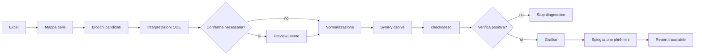

# Graph

## Descrizione del progetto

Graph e' un software Python per trasformare file Excel elastici in problemi di equazioni differenziali risolvibili, verificabili, graficabili e spiegabili.

L'utente fornisce un file `.xlsx` o `.xls` in cui equazioni, parametri, condizioni iniziali, intervalli di grafico e note possono trovarsi in un numero non predeterminato di celle. Graph deve leggere il workbook, costruire una mappa del foglio, proporre interpretazioni candidate con confidenza e celle sorgente, chiedere conferma quando serve, risolvere con SymPy, verificare con `checkodesol`, generare un grafico quando possibile e usare `phi4-mini` tramite Ollama solo per spiegazione o supporto di mapping.

Il principio operativo e':

> Massima elasticita' in ingresso, massima rigidita' in uscita.

## Stato SDD

La costituzione aggiornata e' in `specs/000-costituzione-del-progetto.md`.

Le vecchie specifiche orientate a una pagina HTML5 per grafici tabellari generici restano nel repository come materiale storico finche' non vengono riallineate o archiviate. Da questa revisione in avanti, la fonte di verita' e' il dominio:

```text
Excel elastico -> mapping celle -> problema ODE -> SymPy -> verifica -> grafico -> spiegazione phi4-mini
```

## Fatti

- Input: file Excel `.xlsx` o `.xls`.
- Ambiente target: Python locale.
- Solver iniziale: SymPy.
- Grafico iniziale: matplotlib e numpy.
- LLM locale: Ollama con modello `phi4-mini`.
- Coordinamento SDD opzionale: `symposium.py` con backend Redis.
- Prototipi esistenti:
  - `scripts/ode_phi4_solver.py`, con symposium/Redis;
  - `scripts/ode_phi4_mini_solver.py`, standalone senza symposium/Redis.

## Perimetri iniziali

| Area | Dentro | Fuori nella prima fase |
| --- | --- | --- |
| Excel | celle libere, fogli multipli, blocchi candidati | PDF, immagini, database |
| Oggetti | equazione, parametri, condizioni iniziali, range grafico, note | semantica fisica completa |
| Equazioni | ODE primo e secondo ordine | PDE, sistemi ODE, equazioni stocastiche |
| Solver | SymPy + verifica | soluzione affidata al solo LLM |
| LLM | spiegazione, mapping candidato, diagnostica | autorita' matematica primaria |
| Output | mapping, soluzione, verifica, grafico, warning | risultato non tracciabile |

## Pipeline



## Regole non negoziabili

- Nessun risultato senza celle sorgente.
- Nessuna scelta automatica senza confidenza e motivazione.
- Nessun calcolo definitivo se esistono interpretazioni incompatibili non risolte.
- Nessun grafico se restano simboli liberi necessari.
- Nessuna spiegazione LLM puo' prevalere su una verifica SymPy positiva.
- Ogni euristica nuova deve entrare in specifica, test o `AI-LEDGER.md`.

## Documenti principali

- `specs/000-costituzione-del-progetto.md`: costituzione aggiornata.
- `specs/007-excel-equazioni-differenziali-python.md`: specifica operativa del nuovo Graph.
- `adr/ADR-003-python-sympy-ollama-phi4-mini.md`: decisione architetturale.
- `tasks/TASK-004-rifondazione-graph-ode-excel.md`: task di riallineamento iniziale.
- `AI-LEDGER.md`: regole anti-recidiva obbligatorie.

## Uso dei prototipi

Standalone senza symposium:

```powershell
python .\scripts\ode_phi4_mini_solver.py --equation "y' = a*y" --params "a=2" --ics "y(0)=1" --plot
```

Versione con symposium:

```powershell
python .\scripts\ode_phi4_solver.py --equation "y' = a*y" --params "a=2" --ics "y(0)=1" --plot
```

I prototipi sono prove tecniche, non ancora il prodotto Excel completo.
