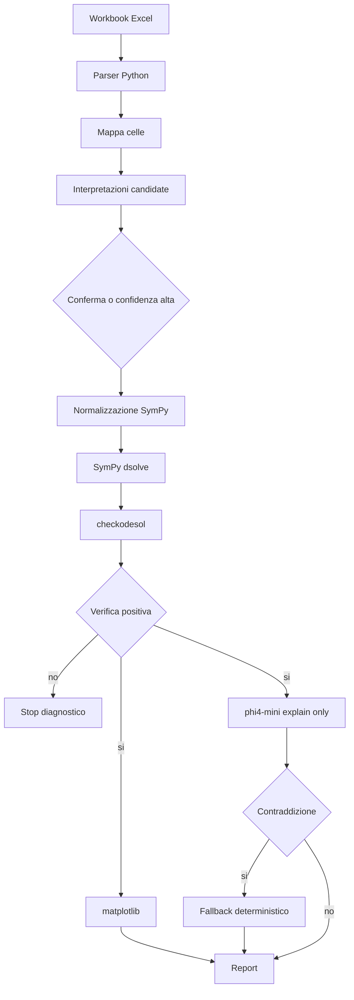

# ADR-003 - Python, SymPy, matplotlib e Ollama phi4-mini per Graph ODE

- Data: 2026-07-24
- Stato: accettata
- Decisore: progetto Graph

## Contesto

Graph cambia obiettivo: da prototipo HTML5 per grafici tabellari generici a software Python per leggere Excel elastici e ricostruire problemi di equazioni differenziali.

Il nuovo dominio richiede:

- parsing di workbook Excel;
- mapping tracciabile di celle e blocchi;
- soluzione simbolica;
- verifica matematica;
- grafico numerico;
- spiegazione in linguaggio naturale;
- controllo rigoroso delle ambiguita'.

## Decisione

Adottare come architettura iniziale:

- Python come linguaggio applicativo;
- SymPy come motore di soluzione e verifica;
- matplotlib e numpy per grafici;
- Ollama con `phi4-mini` come LLM locale di spiegazione e supporto;
- `symposium.py` come strumento di coordinamento SDD quando Redis e' disponibile;
- output tracciabili in console, JSON, Markdown e PNG nelle evoluzioni successive.

## Motivazione

Python e' piu' adatto del browser puro per:

- usare SymPy;
- orchestrare parsing Excel, verifica e grafici;
- integrare Ollama locale;
- salvare mapping e report riproducibili;
- costruire test su corpus Excel.

SymPy offre una prova computazionale migliore di una spiegazione LLM. `phi4-mini` resta utile, ma solo come strato esplicativo o assistente di mapping.

## Alternative scartate

| Alternativa | Motivo scarto |
| --- | --- |
| Continuare con HTML5 puro | Non offre un percorso semplice e robusto per SymPy/Ollama locale e report tracciabili |
| Usare solo `phi4-mini` per risolvere | Gia' osservate contraddizioni rispetto a soluzioni verificate |
| Richiedere Excel con celle fisse | Contraddice l'obiettivo di elasticita' accettato dall'utente |
| Accettare Excel totalmente libero senza stop | Produce risultati plausibili ma falsi |
| Usare symposium come runtime obbligatorio | Redis/Docker possono non essere disponibili; non devono bloccare il calcolo matematico |

## Conseguenze

- Le specifiche HTML5 precedenti sono da riallineare o archiviare.
- Le nuove specifiche devono descrivere perimetri, configurazioni e criteri di stop.
- Il prodotto iniziale sara' CLI-first o locale Python-first.
- Ogni funzione di parsing Excel deve restituire celle sorgente e confidenza.
- Il LLM non puo' sovrascrivere una verifica SymPy.

## Black hat

Il rischio principale e' che l'elasticita' venga confusa con liberta' di interpretare. Questo produrrebbe output matematicamente eleganti ma semanticamente falsi.

Contromisura:

- confidenza obbligatoria;
- preview delle interpretazioni;
- stop su ambiguita' incompatibili;
- report con celle sorgente;
- soppressione delle spiegazioni LLM contraddittorie.

## Diagramma architetturale

## Collegamenti

- `specs/000-costituzione-del-progetto.md`
- `specs/007-excel-equazioni-differenziali-python.md`
- `scripts/ode_phi4_solver.py`
- `scripts/ode_phi4_mini_solver.py`
- `AI-LEDGER.md`
