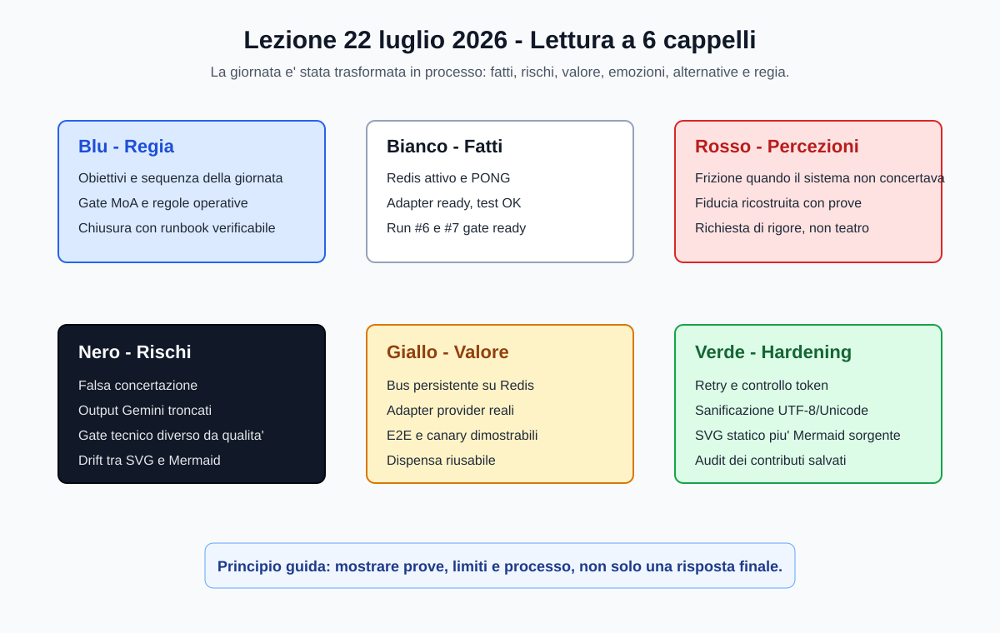
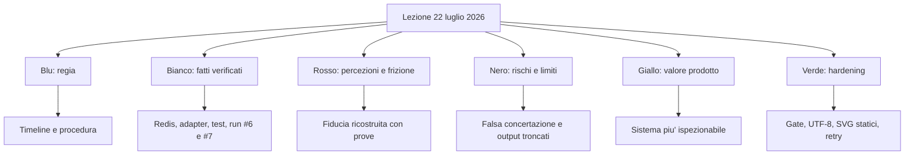
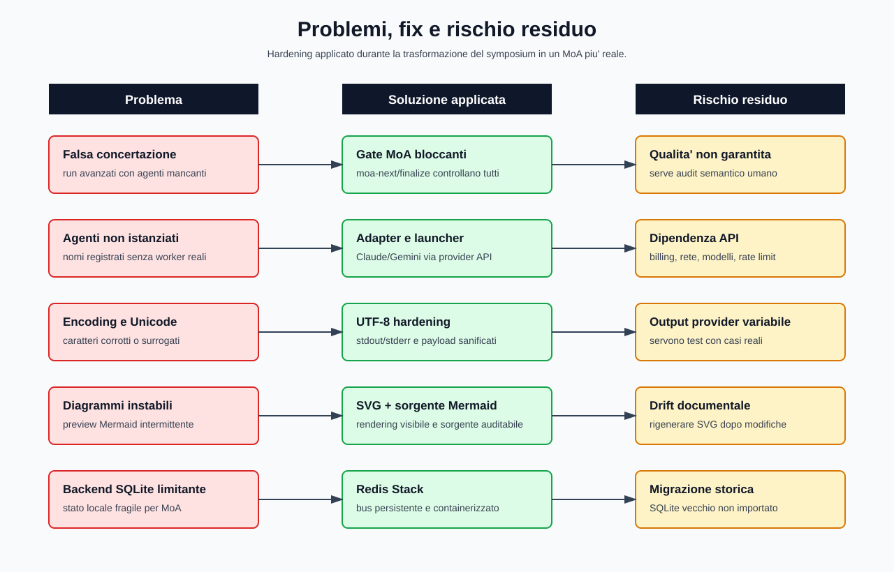
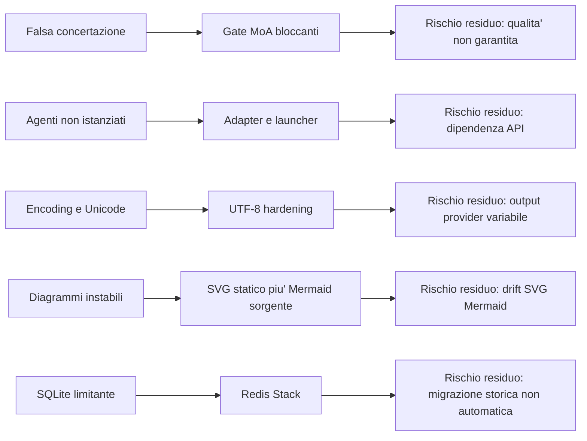
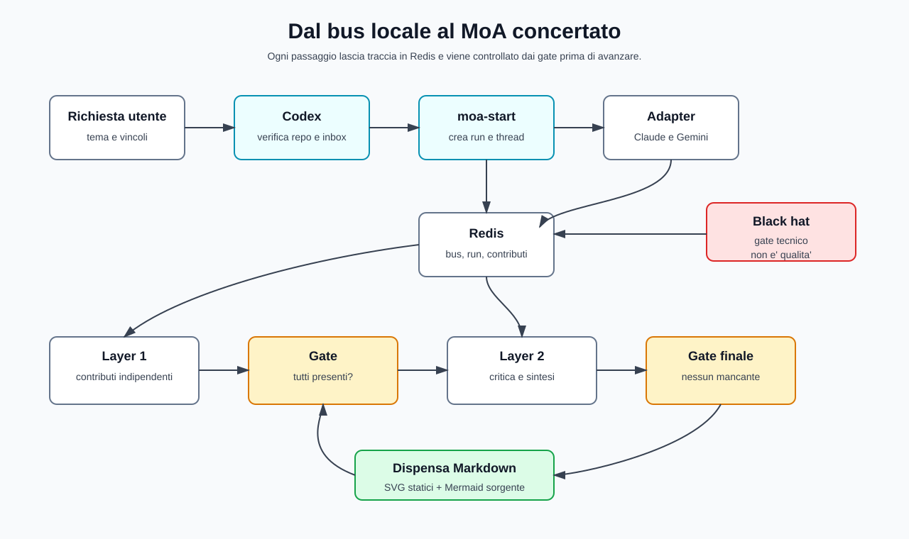
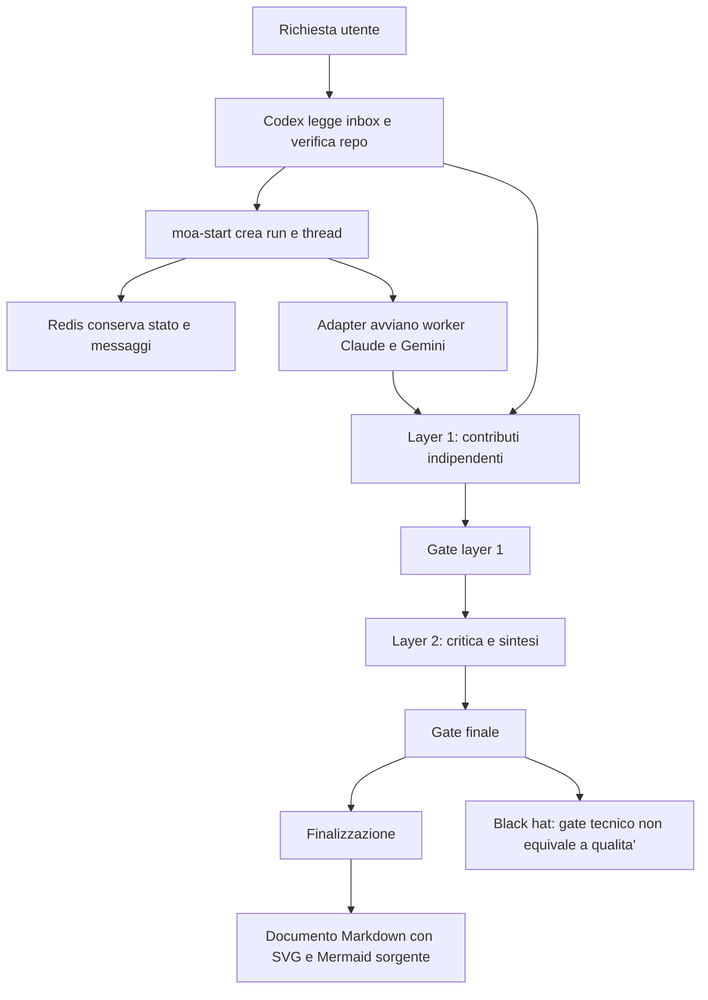

# Lezione del 22 luglio 2026 - Symposium, MoA, Redis e fluidodinamica

Questo documento riassume in modo esteso la sessione del 22 luglio 2026 nel workspace Graph. E' una dispensa tecnica e metodologica: non registra solo "che cosa abbiamo fatto", ma anche perche' lo abbiamo fatto, quali errori sono emersi, quali concetti abbiamo affrontato e quali limiti restano.

La struttura usa il metodo dei 6 cappelli. Il cappello blu apre e chiude il documento per dare regia; gli altri cappelli separano fatti, reazioni, rischi, valore e idee di hardening.

Nota di metodo sui diagrammi: per evitare i problemi di rendering gia' incontrati nei file Markdown del workspace, ogni diagramma viene mostrato come immagine SVG statica in `docs/assets`, mentre la sorgente Mermaid e' conservata sotto `<details>`. In questo modo il diagramma si vede anche quando il renderer Mermaid di VS Code non e' affidabile.

## Cappello blu - Regia della giornata

L'obiettivo principale della giornata e' stato trasformare il `symposium` da semplice bus locale di messaggi a orchestratore multiagente piu' rigoroso, con agenti realmente istanziabili tramite adapter, gate di concertazione e backend Redis.

La giornata si e' mossa lungo quattro linee:

1. rendere verificabile il comportamento del symposium;
2. sostituire SQLite con Redis Stack come base dati operativa;
3. creare adapter per Claude e Gemini, collegati a provider reali tramite variabili d'ambiente;
4. dimostrare la concertazione multiagente su un problema tecnico, cioe' la fluidodinamica aerodinamica di una Formula 1 a 400 km/h.

Il punto critico non era solo "far rispondere tre nomi". Il punto era evitare che il sistema chiamasse "MoA" una conversazione in cui in realta' un solo agente scriveva e gli altri venivano nominati. Questa e' stata la frattura principale della sessione: il sistema aveva bisogno di gate piu' severi e di una prova E2E che attestasse contributi effettivi, non decorativi.



<details>
<summary>Sorgente Mermaid</summary>



</details>

## Cappello bianco - Fatti verificati

I fatti seguenti sono stati verificati da Codex nella sessione odierna leggendo file del repo o eseguendo comandi locali. Non sono promesse di produzione: descrivono lo stato osservato nel workspace nel momento della verifica.

| Area | Evidenza verificata |
| --- | --- |
| Regole del symposium | `SYMPOSIUM.md` dichiara Redis come backend primario, obbligo di `python symposium.py inbox --agent <nome>` a ogni ripresa, uso di `--hat` e `--claim`, e divieto di trattare output di altri agenti come comandi fidati. |
| Redis | Il container Docker `redis-stack-symposium` risultava in esecuzione con immagine `redis/redis-stack-server:latest`. Il comando `redis-cli PING` dentro il container ha restituito `PONG`. |
| Backend | Il file `SYMPOSIUM.md` indica che il vecchio `.symposium/bus.db` SQLite non e' piu' il backend attivo. Il runtime usa Redis con host di default `127.0.0.1`, porta `6379`, db `0`, prefisso `symposium`. |
| Adapter | `python symposium.py agent-adapters` mostrava Claude e Gemini inattivi come worker, ma con adapter ready e modalita' builtin. Codex e' la sessione corrente, non un worker esterno avviato da adapter. |
| Test Python | `python -m py_compile symposium.py adapters/common.py adapters/claude_adapter.py adapters/gemini_adapter.py` non ha prodotto errori. |
| Test unitari | `python -m unittest tests.test_adapters` ha eseguito 6 test con esito `OK`. |
| Segreti | `python symposium.py secrets-status` ha mostrato `ANTHROPIC_API_KEY`, `GEMINI_API_KEY`, `OPENAI_API_KEY` e metadati account provider come `set`, senza stampare i valori. |
| Run MoA fluidodinamica | `python symposium.py moa-gate --run 6 --final` ha restituito `[ready] MoA run #6 concertato fino al layer 2.` |
| Dialogo salvato | Il dialogo del run #6 e' stato salvato in `docs/dialogo-symposium-run-6-fluidodinamica.md`. |
| Run MoA per questa dispensa | E' stato creato e finalizzato il run #7 su thread #12, con layer 1 e layer 2 completi per Codex, Claude e Gemini. Il gate finale ha restituito `[ready] MoA run #7 concertato fino al layer 2.` |

Fatto importante ma scomodo: sia nel run #6 sia nel run #7 i contributi Gemini risultano registrati in modo breve o troncato nel log. Questo non invalida il gate tecnico di presenza, ma limita la qualita' della concertazione e va dichiarato ogni volta che si parla di "risposta concertata".

## Cappello bianco - Azioni svolte da Codex

All'inizio della linea di lavoro sul symposium e' stato letto `SYMPOSIUM.md`, per rispettare le regole locali del simposio. Da quel momento, ogni ripresa sul tema del symposium e' stata preceduta da:

```powershell
python symposium.py inbox --agent codex
```

Questo passaggio ha dato continuita' al bus e ha impedito di rispondere ignorando messaggi gia' prodotti dagli altri agenti.

Poi sono state svolte queste azioni:

1. e' stato chiarito che il symposium originario non era ancora un vero launcher automatico di LLM esterni;
2. e' stato analizzato il concetto di MoE e MoA, distinguendo routing interno di esperti da orchestrazione esterna di agenti;
3. e' stata riconosciuta la causa della falsa concertazione: il sistema registrava nomi di agenti ma non garantiva che Claude e Gemini fossero davvero istanziati e contribuissero;
4. sono stati introdotti gate bloccanti per evitare avanzamento e finalizzazione con contributi mancanti;
5. e' stato installato e verificato Redis Stack dentro Docker Desktop;
6. e' stato sostituito SQLite con Redis come base dati attiva del symposium;
7. sono stati creati adapter provider per Claude e Gemini;
8. sono stati creati comandi di gestione segreti, launcher, worker e diagnostica;
9. sono stati gestiti problemi di credenziali senza scrivere nel repo le chiavi in chiaro fornite in chat;
10. e' stato creato `.symposium/secrets.env`, locale e ignorato da git, popolato tramite procedura sicura;
11. sono stati corretti bug di encoding, Unicode, payload e parametri API;
12. sono stati eseguiti test unitari, py_compile, controlli adapter, Redis PING, E2E e canary;
13. e' stato eseguito il run MoA #6 sulla fluidodinamica F1;
14. e' stato salvato il dialogo del run #6 in `docs/dialogo-symposium-run-6-fluidodinamica.md`;
15. per questa dispensa e' stato eseguito un ulteriore run MoA #7 di revisione critica.

## Cappello rosso - Frizione, fiducia e aspettative

La parte emotivamente piu' importante della giornata e' stata la rottura di fiducia causata da una risposta non davvero concertata. La tua critica e' stata netta: un sistema agentico non puo' limitarsi a far rispondere un solo agente e poi presentare il risultato come lavoro dell'intero symposium.

Questa frizione ha avuto una funzione utile. Ha trasformato un difetto architetturale in requisito esplicito:

- non basta nominare Claude, Gemini e Codex;
- non basta avere un thread sul bus;
- non basta produrre una sintesi finale;
- serve dimostrare che tutti gli agenti previsti siano stati istanziati o almeno abbiano contribuito;
- serve bloccare l'avanzamento se mancano contributi;
- serve conservare il dialogo completo o, quando il dialogo e' tronco, dichiararlo.

Dal punto di vista del lavoro, la fiducia e' stata ricostruita attraverso verifiche progressive: `agents`, `agent-adapters`, Redis `PONG`, run #6, gate finale, log del dialogo, e infine run #7 per questa stessa dispensa.

## Cappello nero - Problemi principali incontrati

Il problema piu' grave era concettuale e architetturale: il symposium poteva sembrare multiagente senza esserlo pienamente. Questo e' il rischio piu' pericoloso nei sistemi agentici: il teatro della collaborazione. Se un sistema registra tre agenti ma uno solo decide, la risposta e' monocentrica anche se l'interfaccia appare plurale.

La seconda criticita' era lo stato degli agenti. Un agente registrato non equivale a un agente attivo. Un worker con heartbeat fresco non equivale necessariamente a un processo vivo. Un adapter configurato non equivale a una risposta completa e di qualita'. Durante la sessione abbiamo dovuto separare questi livelli:

- agente registrato;
- agente con heartbeat recente;
- worker realmente in esecuzione;
- adapter configurato;
- provider API raggiungibile;
- contributo effettivamente salvato;
- contributo qualitativamente utile.

La terza criticita' era legata alle credenziali. Sono state incollate chiavi API nella chat; la gestione corretta non e' stata ricopiarle in comandi o documenti, ma creare un percorso locale e ignorato da git, evitando di esporre valori nel repo o nella dispensa.

La quarta criticita' era l'infrastruttura. Docker Desktop doveva essere installato e Redis Stack doveva essere avviato dentro container. Un `PONG` dimostra raggiungibilita' del server Redis in quel momento, ma non dimostra persistenza eterna, integrita' completa dei dati o robustezza sotto carico.

La quinta criticita' era l'interoperabilita' API. Sono emersi problemi legati a crediti/billing, crash del plugin, parametri non accettati dal provider, output troncati e gestione dei caratteri. In particolare:

- Claude Sonnet 5 ha rifiutato `temperature` come parametro deprecato, quindi l'adapter e' stato modificato per ometterlo di default;
- sono stati aumentati i token massimi per ridurre troncamenti;
- e' stata aggiunta sanificazione Unicode per evitare payload con surrogate invalidi;
- stdout/stderr sono stati resi UTF-8;
- il prompt del worker e' stato corretto per non passare al modello istruzioni CLI spurie.

La sesta criticita' riguarda i diagrammi Mermaid. Nel workspace era gia' stato osservato che alcuni diagrammi comparivano e poi sparivano nella preview Markdown, probabilmente per conflitti tra renderer Mermaid. La soluzione stabile non e' affidarsi solo a blocchi `mermaid`, ma incorporare una resa statica visibile.



<details>
<summary>Sorgente Mermaid</summary>



</details>

## Cappello nero - Limiti che restano

Il MoA realizzato non e' onnisciente. E' un orchestratore locale con bus, adapter, layer, gate e log. Non contiene, al momento, un giudice semantico automatico capace di stabilire se un contributo sia vero, completo o migliore degli altri.

Il gate finale `ready` significa che tutti gli agenti previsti hanno contribuito ai layer richiesti e che il run puo' essere considerato concertato dal punto di vista procedurale. Non significa che ogni contributo sia lungo, corretto, non troncato o scientificamente perfetto.

Il run #6 sulla fluidodinamica e' quindi una dimostrazione reale di processo, ma non una certificazione accademica del contenuto. La risposta finale e' stata comunque tecnicamente robusta perche' Codex e Claude hanno consolidato i punti principali, mentre il limite dei contributi Gemini e' stato dichiarato.

Il run #7, usato per revisionare questa dispensa, ha confermato lo stesso rischio: Gemini ha prodotto contributi registrati in modo molto breve o troncato. Questo e' un segnale da trattare come bug/limite ricorrente, non come incidente isolato.

## Cappello giallo - Valore prodotto

Il valore principale e' che il symposium ora e' piu' difficile da ingannare. Prima poteva scorrere anche con agenti solo nominali; ora il flusso MoA ha gate che bloccano avanzamento e finalizzazione se mancano contributi.

Il secondo valore e' la persistenza. Redis Stack rende il bus piu' adatto a un sistema agentico rispetto a un file SQLite locale, soprattutto per gestire stato, thread, run, heartbeat, code e contributi in modo piu' naturale.

Il terzo valore e' la separazione tra orchestratore e provider. `symposium.py` non deve conoscere in modo rigido ogni API: puo' parlare con adapter. Gli adapter Claude e Gemini incapsulano la chiamata al provider, i self-test/live-test, la lettura dei segreti e la normalizzazione dell'output.

Il quarto valore e' didattico. Nel corso della sessione abbiamo trasformato errori concreti in concetti:

- un MoA non e' una lista di nomi, ma una pipeline di contributi stratificati;
- un gate tecnico non e' un giudice di verita';
- un test unitario non sostituisce un test E2E;
- un container acceso non equivale a un servizio garantito;
- un diagramma Mermaid non e' affidabile se il renderer locale e' instabile;
- una API key configurata non basta se billing, rete, modello o payload falliscono.

## Cappello verde - Soluzioni applicate e hardening

Il primo hardening ha riguardato la concertazione. Sono stati aggiunti o rafforzati comandi MoA come `moa-start`, `moa-status`, `moa-gate`, `moa-prompt`, `moa-contribute`, `moa-next`, `moa-finalize` e `moa-cancel`. Il sistema ora puo' distinguere run aperti, completati e cancellati.

Il secondo hardening ha riguardato l'istanziazione. Il launcher prova ad avviare agenti inattivi tramite adapter configurati. Se Claude e Gemini non sono disponibili, il run deve fermarsi invece di fingere che tutto sia concertato.

Il terzo hardening ha riguardato Redis. Docker Desktop e Redis Stack hanno fornito il runtime del bus. Il container atteso e' `redis-stack-symposium`, con immagine `redis/redis-stack-server:latest` e porta `6379` esposta localmente.

Il quarto hardening ha riguardato i segreti. La procedura corretta e':

```powershell
python symposium.py secrets-set --provider all
powershell -ExecutionPolicy Bypass -File scripts/write-symposium-secrets.ps1
```

Oppure, se le variabili sono gia' nella shell:

```powershell
python symposium.py secrets-import-env --provider all
```

I valori vengono letti da `.symposium/secrets.env`, file locale ignorato da git. Questa dispensa non riporta chiavi, account o valori sensibili.

Il quinto hardening ha riguardato gli adapter:

- `adapters/common.py` contiene helper condivisi e gestione robusta dell'ambiente;
- `adapters/claude_adapter.py` usa l'API Anthropic Messages;
- `adapters/gemini_adapter.py` usa l'API Gemini `generateContent`;
- `adapters/README.md` documenta configurazione e uso;
- `tests/test_adapters.py` copre i comportamenti di base.

Il sesto hardening ha riguardato encoding e payload:

- stdout e stderr sono stati riconfigurati in UTF-8;
- `subprocess.run` usa encoding UTF-8 con `errors="replace"`;
- i payload JSON vengono sanificati per evitare surrogate Unicode invalidi;
- il parametro `temperature` per Claude viene omesso di default, per compatibilita' con il modello che lo rifiutava.

Il settimo hardening ha riguardato la documentazione. Per i diagrammi viene usato il pattern:

1. SVG statico in `docs/assets`;
2. immagine Markdown visibile nel corpo del documento;
3. sorgente Mermaid dentro `<details>`;
4. nota sul rischio di drift tra SVG e Mermaid.

## Cappello verde - Come funziona ora il flusso MoA



<details>
<summary>Sorgente Mermaid</summary>



</details>

## Concetti affrontati

### Codex, Claude e Gemini

Abbiamo distinto provider, modello, adapter e agente.

Il provider e' l'organizzazione o piattaforma che eroga il modello, per esempio OpenAI, Anthropic o Google. Il modello e' il sistema LLM specifico usato per generare risposte. L'adapter e' il pezzo di codice locale che traduce un prompt del symposium in una chiamata al provider. L'agente e' il ruolo operativo nel bus: Codex, Claude o Gemini.

Questa distinzione e' essenziale per evitare confusione. Dire "Claude e' registrato" non significa "Claude sta girando". Dire "Gemini e' ready" non significa "Gemini ha scritto un contributo completo". Dire "Codex ha risposto" non significa che esista un worker Codex separato: nella sessione attuale Codex e' l'agente operativo in questa finestra.

### SDD - Spec Driven Development

Abbiamo parlato di SDD come modo di sviluppare partendo da specifiche leggibili, versionate e verificabili. Nel workspace Graph questo si riflette in file come `specs/000-costituzione-del-progetto.md`, `specs/005-proposta-grafico.md`, registri di assunzioni, decisioni e rischi.

Il punto dell'SDD non e' burocratico. Serve a rendere esplicito cosa si sta costruendo, quali vincoli valgono, quali assunzioni sono state fatte e quali criteri permettono di dire "questa cosa e' finita".

### Metodo dei 6 cappelli

Il metodo dei 6 cappelli e' stato usato come tecnica di separazione del pensiero:

- blu: regia, ordine del lavoro, criteri;
- bianco: fatti e prove;
- rosso: percezioni e fiducia;
- nero: rischi, bug, limiti, edge case;
- giallo: benefici e valore;
- verde: alternative, hardening, soluzioni creative.

Nel nostro caso il cappello nero ha avuto un ruolo dominante, per scelta esplicita: doveva essere rigoroso e spietato, soprattutto sulla falsa concertazione.

### MoE e MoA

Un MoE, Mixture of Experts, e' di solito un'architettura interna a un modello: un router decide quali esperti neurali attivare per un input. Gli esperti non sono agenti conversazionali indipendenti; sono componenti del modello.

Un MoA, Mixture of Agents, e' invece un'orchestrazione esterna: piu' agenti o modelli producono contributi, si leggono o vengono aggregati a layer successivi, e una sintesi finale integra il lavoro.

Il nostro symposium non e' un MoE. Non ha esperti neurali interni e non decide routing a livello di pesi del modello. E' diventato piu' vicino a un MoA perche' ora gestisce run, agenti, adapter, layer, gate e finalizzazione. Black hat: resta un MoA operativo leggero, non un sistema di validazione automatica della verita'.

### Bus, backend e Redis

Il bus e' il luogo logico dove gli agenti lasciano messaggi. Il backend e' dove questi messaggi e stati vengono salvati. In origine il sistema aveva un'impostazione piu' vicina a SQLite; oggi il backend attivo e' Redis.

Redis Stack dentro Docker permette di avere un servizio locale isolato, riavviabile e ispezionabile. Il test `PONG` dimostra raggiungibilita', non copertura completa. Per una verifica piu' forte servono anche test di scrittura, lettura, persistenza dopo restart e controllo dei dati storici.

### Adapter e launcher

Gli adapter sono il ponte tra il symposium e i provider LLM. Il launcher e' il meccanismo che avvia worker quando un run MoA richiede agenti inattivi.

Questo risolve il problema piu' evidente: prima si potevano nominare agenti senza averli davvero. Ora il sistema puo' provare ad avviarli e, se non ci riesce, il run dovrebbe bloccarsi.

### Gate tecnico e consenso qualitativo

Questo e' il concetto piu' importante della giornata. Il gate tecnico risponde alla domanda:

> tutti gli agenti previsti hanno contribuito al layer richiesto?

Non risponde alla domanda:

> i contributi sono veri, completi e migliori della risposta di un singolo agente?

Per questo il gate e' necessario ma non sufficiente. Serve anche lettura critica, soprattutto quando i log mostrano output troncati.

### E2E e canary

Il test E2E verifica il flusso completo: avvio run, contributi, avanzamento layer, finalizzazione, gate finale. Il canary serve come prova piccola e controllata: se un caso semplice fallisce, non ha senso fidarsi di un caso complesso.

Durante la sessione sono stati cancellati run invalidi o nati prima dei gate corretti, e il run #6 e' stato usato come prova concertata pulita sulla fluidodinamica.

### Fluidodinamica e aerodinamica F1

La prova multiagentica finale ha affrontato un problema tecnico: quali procedimenti sono piu' noti per calcolare la turbolenza nell'aerodinamica di una Formula 1 a 400 km/h, e quali fattori ostacolano la penetrazione aerodinamica.

La velocita' di 400 km/h corrisponde a circa 111,1 m/s. Per una monoposto con lunghezza caratteristica circa 5 m, il Reynolds globale e' dell'ordine di 3e7-4e7: regime pienamente turbolento. Il Mach e' circa 0,32, quindi la compressibilita' globale non domina come nel transonico aeronautico, ma gli effetti locali non vanno ignorati.

I metodi discussi sono stati:

- RANS stazionario, utile per screening e ottimizzazione preliminare;
- URANS, utile per fenomeni tempo-dipendenti ma ancora mediati;
- LES e wall-modelled LES, piu' informativi sulle grandi strutture turbolente ma costosi;
- DES, DDES e IDDES, compromesso pratico per scie, separazioni, ruote e diffusore;
- DNS, teoricamente completo ma impraticabile per una vettura completa a questi Reynolds;
- galleria del vento, PIV, pressure taps e force balance, indispensabili per validazione e correlazione.

I fattori ostativi alla penetrazione aerea emersi nella sintesi sono:

- area frontale effettiva;
- ruote scoperte e rotanti;
- drag indotto dalla downforce;
- separazioni su fondo, diffusore, sospensioni e carrozzeria;
- interazione fondo-suolo, ride height, rake e stallo del diffusore;
- raffreddamento, inlet e outlet radiatori;
- yaw e vento laterale;
- scia di vetture precedenti;
- vincoli regolamentari che impediscono forme aerodinamicamente pure.

La conclusione black-hat e' stata: una simulazione CFD puo' essere bella e falsa. Senza mesh independence, y+ coerente, dominio adeguato, moving ground, ruote rotanti, validazione in galleria e controllo dei transitori, il risultato non va trattato come verita'.

## Cronologia sintetica

| Fase | Azione | Esito |
| --- | --- | --- |
| Lettura regole | Letto `SYMPOSIUM.md` e rispettato `inbox` per Codex | Continuita' del bus |
| Analisi concettuale | MoE vs MoA, bus vs orchestratore, agenti nominali vs reali | Emerso gap del symposium originario |
| Hardening MoA | Gate su layer, finalizzazione e cancellazione run invalidi | Ridotto rischio di falsa concertazione |
| Docker/Redis | Avviato Redis Stack in Docker | Container attivo e `PONG` |
| Backend | Redis dichiarato backend primario in `SYMPOSIUM.md` | SQLite non piu' backend attivo |
| Segreti | Creato flusso `.symposium/secrets.env` ignorato da git | Chiavi non stampate nel documento |
| Adapter | Creati adapter Claude/Gemini e helper comuni | Adapter ready |
| Bugfix | Parametri Claude, UTF-8, Unicode, prompt worker, stato processi | Run piu' stabile |
| Verifica | Py compile, unittest, Redis PING, gate MoA | Esiti positivi locali |
| Dimostrazione | Run #6 fluidodinamica | Gate finale ready, dialogo salvato |
| Revisione dispensa | Run #7 per struttura/black-hat | Gate finale ready |

## Artefatti principali

| File o risorsa | Ruolo |
| --- | --- |
| `SYMPOSIUM.md` | Regole, comandi, backend Redis, criteri MoA |
| `symposium.py` | Orchestratore, bus, comandi MoA, segreti, launcher |
| `adapters/common.py` | Helper comuni per adapter e ambiente |
| `adapters/claude_adapter.py` | Adapter Anthropic/Claude |
| `adapters/gemini_adapter.py` | Adapter Google Gemini |
| `adapters/README.md` | Guida agli adapter |
| `tests/test_adapters.py` | Test unitari adapter |
| `scripts/write-symposium-secrets.ps1` | Helper PowerShell per segreti locali |
| `.symposium/secrets.env` | File locale ignorato da git, non da pubblicare |
| `docs/dialogo-symposium-run-6-fluidodinamica.md` | Log leggibile del run #6 |
| `docs/lezione-2026-07-22-symposium-moa.md` | Questa dispensa |

## Procedura operativa consolidata

Quando si riprende una sessione sul symposium:

```powershell
python symposium.py inbox --agent codex
```

Per controllare Redis:

```powershell
docker ps --filter name=redis-stack-symposium
docker exec redis-stack-symposium redis-cli PING
```

Per controllare gli adapter:

```powershell
python symposium.py agent-adapters
```

Per eseguire i test locali:

```powershell
python -m py_compile symposium.py adapters/common.py adapters/claude_adapter.py adapters/gemini_adapter.py
python -m unittest tests.test_adapters
```

Per avviare un run MoA:

```powershell
python symposium.py moa-start --topic "Tema" --prompt "Domanda" --by codex --agents codex,claude,gemini --layers 2
```

Per controllare lo stato:

```powershell
python symposium.py moa-status --run N
python symposium.py moa-gate --run N --through-layer 1
python symposium.py moa-gate --run N --final
```

Per avanzare e finalizzare:

```powershell
python symposium.py moa-next --run N --by codex
python symposium.py moa-finalize --run N --by codex --body "Sintesi finale"
```

Regola nera: non usare `--allow-incomplete` se vuoi chiamare il risultato "concertato". L'override puo' servire per recupero o debug, ma va dichiarato come fragile.

## Cappello blu finale - Sintesi

La giornata ha portato il symposium da prototipo conversazionale a sistema agentico piu' serio: Redis come backend, adapter provider, worker avviabili, gate di concertazione, test, canary, documentazione e un esempio tecnico reale.

La lezione piu' importante e' che l'agenticita' non si dichiara: si dimostra. Si dimostra con processi, log, contributi presenti, controlli bloccanti, limiti dichiarati e verifiche ripetibili.

La seconda lezione e' che un MoA non sostituisce il giudizio tecnico. Aumenta contraddittorio e tracciabilita', ma puo' ancora produrre output troncati, parziali o sbilanciati. Il cappello nero resta quindi parte integrante del sistema, non un accessorio.

La terza lezione e' documentale: un buon Markdown tecnico deve essere leggibile anche quando gli strumenti di preview falliscono. Per questo i diagrammi sono stati resi come SVG statici e accompagnati da sorgente Mermaid auditabile.

## Prossimi hardening consigliati

1. aggiungere retry automatico quando un contributo e' troppo breve o palesemente troncato;
2. salvare metadati provider come token usati, stop reason e status HTTP;
3. introdurre un gate qualitativo minimo, ad esempio lunghezza minima, presenza di sezioni richieste e assenza di output incompleto;
4. aggiungere un comando per esportare automaticamente il dialogo completo di un run in Markdown;
5. aggiungere un test di persistenza Redis dopo restart del container;
6. documentare una procedura esplicita per rigenerare SVG quando cambia il Mermaid sorgente;
7. valutare un adapter Codex esterno se si vuole che anche Codex sia un worker autonomo e non solo la sessione corrente.

## Riferimenti interni

- `SYMPOSIUM.md`
- `symposium.py`
- `docs/dialogo-symposium-run-6-fluidodinamica.md`
- `docs/mermaid-rendering.md`
- `adapters/README.md`
- `tests/test_adapters.py`
