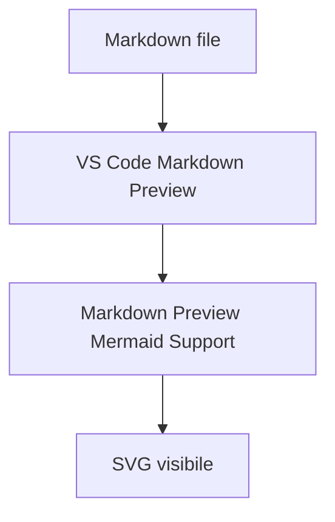

# Mermaid Preview Smoke Test

Questo file serve a verificare se la preview Markdown di VS Code renderizza Mermaid nel workspace.

Se questo diagramma appare e poi scompare, il problema e' nella preview/CSS/estensione, non nel documento `PP5-CONTATORE.mapping.md`.
