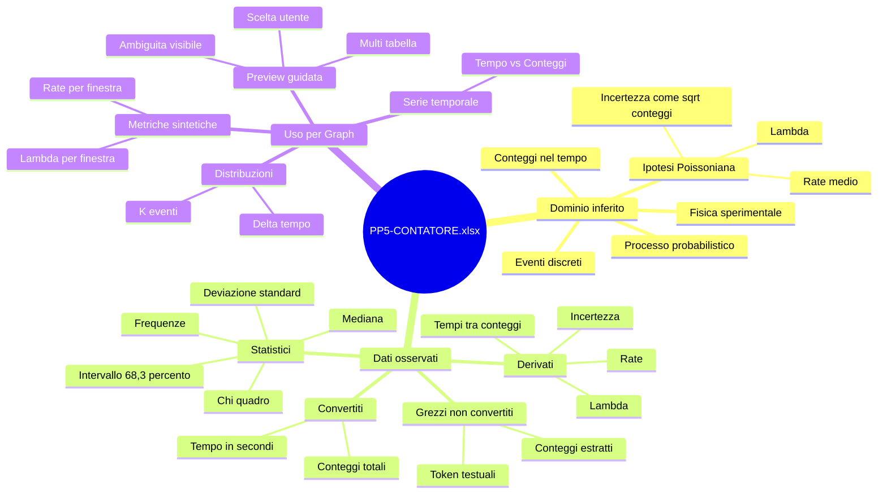
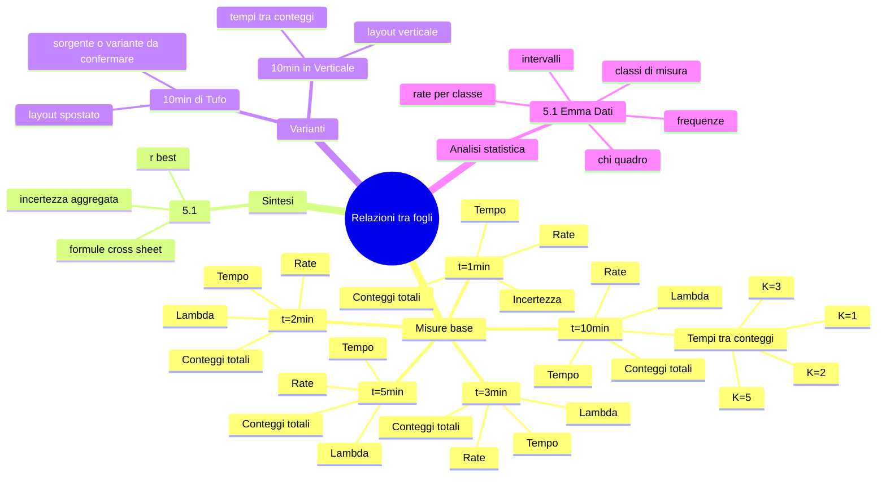
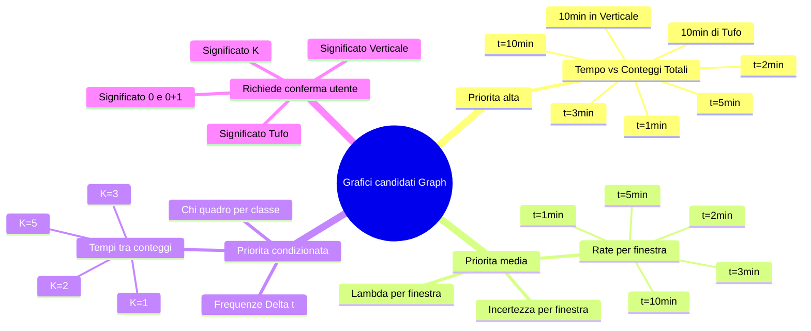

# Mappatura workbook - PP5-CONTATORE.xlsx

## Fonte

- File: `data/PP5-CONTATORE.xlsx`
- Dimensione: 116926 byte
- Fogli: 9
- Stringhe condivise XLSX: 1177
- Metodo di lettura: ispezione diretta dell'archivio `.xlsx` e dei fogli XML interni.

## Limiti della mappatura

- Le formule sono state lette come testo, non ricalcolate.
- I valori riportati sono quelli memorizzati nel file.
- Il significato fisico/statistico e' inferito dai nomi delle colonne e dalle formule; va confermato dall'utente se deve diventare specifica di dominio.
- Le celle con formula vuota nel file XML sono considerate formule presenti ma non interpretabili semanticamente senza ulteriore analisi del workbook originale.

## Dominio inferito

### Classificazione del dominio

Il workbook ricade con alta confidenza nel dominio della **fisica sperimentale con analisi statistica di conteggi nel tempo**.

La sotto-area piu' probabile e' l'analisi di un processo di conteggio di eventi discreti, con stima di rate, incertezza e confronto statistico. Il candidato naturale e' un esperimento di conteggi Poissoniani, compatibile con misure di decadimento, conteggi da rivelatore, eventi casuali nel tempo o fenomeni analoghi in cui si osservano arrivi discreti.

Questa classificazione non e' una certezza di dominio fisico finale: e' una inferenza ad alta confidenza basata su struttura del workbook, nomi delle colonne, formule e relazioni tra fogli. Il documento mantiene quindi due livelli distinti:

- **osservato nel file**: nomi sheet, celle, colonne, formule e valori memorizzati;
- **inferito**: interpretazione fisica/statistica delle strutture osservate.

### Indizi osservati

| Indizio | Dove compare | Interpretazione probabile |
| --- | --- | --- |
| `Tempo [s]` | fogli di misura | asse temporale espresso in secondi |
| `Conteggi Totali` / `Conteggi totali` | fogli di misura | conteggio cumulativo degli eventi osservati |
| `rate` / `Rate` | blocchi laterali e foglio `5.1` | frequenza media di eventi per unita' di tempo |
| `Lambda` / `lambda` | blocchi laterali | parametro di processo o valore atteso scalato |
| `incertezza` / `inc` | blocchi laterali | incertezza statistica associata al rate o al parametro |
| `SQRT(conteggi)` | formule | incertezza tipica dei conteggi discreti, compatibile con modello Poissoniano |
| finestre `1min`, `2min`, `3min`, `5min`, `10min` | nomi dei fogli | misure aggregate su durate diverse |
| `tempo tra conteggi` | foglio `t=10min` | intervalli temporali tra eventi successivi |
| `K=1`, `K=2`, `K=3`, `K=5` | foglio `t=10min` | intervalli aggregati su gruppi di eventi |
| `Frequenza (0)`, `Frequenza (0+1)` | foglio `5.1 Emma Dati` | distribuzioni empiriche di classi o conteggi |
| `Deviazione standard`, `Mediana`, `Intervallo al 68,3%` | foglio `5.1 Emma Dati` | statistiche descrittive o confronto con distribuzione attesa |
| `chi^s` | foglio `5.1 Emma Dati` | indicatore di test statistico o bonta' di adattamento |

### Lettura di dominio

Il workbook sembra documentare un esperimento in cui:

1. vengono acquisiti dati grezzi non convertiti;
2. i dati grezzi vengono trasformati in tempi evento e conteggi cumulativi;
3. le misure vengono ripetute o aggregate su finestre temporali diverse;
4. per ogni finestra si calcolano rate, lambda e incertezza;
5. un foglio di sintesi calcola un rate aggregato o "best";
6. un foglio di analisi statistica confronta frequenze, incertezze, statistiche e possibili test.

Per Graph questo e' importante perche' il grafico "giusto" non e' soltanto una scelta tecnica tra colonne numeriche. Il dominio suggerisce almeno quattro famiglie di visualizzazione distinte:

- andamento cumulativo `Tempo [s]` -> `Conteggi Totali`;
- confronto tra rate o lambda su finestre temporali diverse;
- distribuzione dei tempi tra conteggi;
- tabelle statistiche di frequenze, intervalli e test.

### Mappa mentale del dominio



<details>
<summary>Sorgente Mermaid</summary>



</details>

### Mappa mentale delle relazioni di dominio



<details>
<summary>Sorgente Mermaid</summary>



</details>

### Mappa mentale dei grafici candidati



<details>
<summary>Sorgente Mermaid</summary>



</details>

### Implicazioni del dominio per Graph

Il dominio cambia le priorita' di interpretazione:

- una coppia `Tempo [s]` / `Conteggi Totali` non va trattata come tabella generica, ma come serie temporale cumulativa;
- `rate`, `Lambda` e `incertezza` sono metriche derivate, non normali colonne della tabella principale;
- i fogli multi-tabella non devono essere appiattiti in una sola tabella;
- i grafici candidati devono distinguere dati primari, dati derivati e statistiche;
- formule e riferimenti cross-sheet sono segnali forti di dipendenza logica tra fogli;
- se il sistema non capisce il dominio, deve comunque mostrare all'utente le tabelle candidate e non imporre un solo grafico.

### Confidenza e conferme richieste

| Affermazione | Stato | Confidenza |
| --- | --- | --- |
| Il workbook riguarda conteggi nel tempo | inferito da colonne e formule | alta |
| Il modello statistico e' compatibile con conteggi Poissoniani | inferito da `SQRT(conteggi)` e rate | alta |
| `Tempo [s]` e' asse indipendente per grafici primari | inferito da intestazione e valori monotoni | alta |
| `Conteggi Totali` e' conteggio cumulativo | inferito da sequenza crescente 1..N | alta |
| `rate` e `Lambda` sono metriche derivate | inferito da formule e posizione laterale | alta |
| `10min in Verticale` e' una variante layout del 10 minuti | inferito da schema simile | media |
| `10min di Tufo` e' una variante sperimentale o sorgente separata | inferito da nome e layout | media-bassa |
| `5.1 Emma Dati` deriva dagli altri fogli | inferito da coerenza semantica, non da formule cross-sheet | media-bassa |
| `chi^s` e' un test chi quadro | inferito dal nome | media |

Queste conferme sono necessarie prima di trasformare l'inferenza di dominio in regole automatiche rigide.

## Sintesi strutturale

Il workbook contiene tre famiglie principali di fogli:

1. Fogli di misura per finestre temporali: `t=1min`, `t=2min`, `t=3min`, `t=5min`, `t=10min`.
2. Fogli di misura variante a 10 minuti: `10min in Verticale`, `10min di Tufo`.
3. Fogli di sintesi o analisi: `5.1`, `5.1 Emma Dati`.

La relazione principale osservabile e' questa:

```text
t=1min
t=2min
t=3min
t=5min
t=10min
  -> 5.1

5.1 Emma Dati
  -> sintesi manuale/statistica separata, senza riferimenti cross-sheet osservati

10min in Verticale
10min di Tufo
  -> varianti indipendenti dello schema di misura a 10 minuti
```

## Schema concettuale inferito

### Misura grezza

Nei fogli di misura, le prime colonne contengono dati grezzi non convertiti:

- intestazione: `NON CONVERTITI`;
- colonna testo: sequenze grezze con marcatori come `t...$...`;
- colonna numerica: conteggi o valori estratti dalla sequenza grezza.

Schema ricorrente:

| Ruolo | Colonne tipiche | Note |
| --- | --- | --- |
| dato grezzo | `A` | stringhe non convertite o token numerici grezzi |
| conteggio estratto | `B` | valori numerici associati al dato grezzo |

Nel foglio `10min di Tufo`, il blocco grezzo e' chiaramente `A:B`.

### Misura convertita

La tabella convertita contiene una sequenza temporale e conteggi cumulativi:

| Ruolo | Colonne tipiche | Variante `10min di Tufo` | Note |
| --- | --- | --- | --- |
| titolo blocco | `C` | `D` | `CONVERTITI` |
| tempo | `D` | `E` | `Tempo [s]` |
| conteggi cumulativi | `E` | `F` | `Conteggi Totali` |

Questa e' probabilmente la tabella primaria da usare per Graph nei grafici tempo/conteggi.

### Metriche di sintesi

Accanto alle tabelle principali compaiono piccoli blocchi con:

- `rate` / `Rate`;
- `Lambda` / `lambda`;
- `incertezza` / `inc`;
- `cont tot` / `tot conteggi`.

Questi blocchi sono misure derivate e non fanno parte della serie temporale primaria.

### Tempi tra conteggi

Nei fogli a 10 minuti compaiono colonne derivate sui tempi tra conteggi:

- `t=10min`: colonne `J:M`, con intestazioni `K=1`, `K=2`, `K=3`, `K=5`.
- `10min in Verticale`: colonna `J`, con differenza tra tempi consecutivi.

Questi blocchi rappresentano dati derivati dalla colonna tempo e possono essere visualizzati separatamente.

## Mappa dei fogli

### `t=1min`

| Proprieta' | Valore |
| --- | --- |
| Range effettivo | `A1:I57` |
| Celle non vuote | 179 |
| Righe con dati | 57 |
| Colonne con dati | 7 |
| Formule | 4 |

Blocchi rilevati:

| Range | Ruolo inferito |
| --- | --- |
| `A1:E57` | blocco principale: non convertiti + convertiti |
| `G2:G5` | metrica `lambda` e `incertezza` |
| `I2:I3` | metrica `rate` |
| `G8:G9` | totale conteggi |
| `I5:I5` | incertezza rate duplicata o metrica collegata |

Colonne:

| Colonna | Dati | Interpretazione |
| --- | --- | --- |
| `A` | 57 valori, misto testo/numeri | dati non convertiti |
| `B` | 56 numerici, min 0, max 3 | conteggi estratti |
| `C` | `CONVERTITI` | titolo blocco convertito |
| `D` | `Tempo [s]`, 27 numerici, min 1.421494, max 56.048849 | asse tempo |
| `E` | `Conteggi totali`, 27 numerici, min 1, max 27 | conteggi cumulativi |
| `G` | `lambda`, `incertezza`, `tot conteggi` | metriche |
| `I` | `rate` | metrica rate |

Formule:

```text
I3 = G3*1
G5 = SQRT(27)/60
I5 = SQRT(27)/60
G9 = sum(B:B)
```

Inferenza Graph:

- tabella primaria candidata: `D1:E28`;
- grafico candidato: linea o scatter `Tempo [s]` -> `Conteggi totali`;
- warning: il foglio contiene anche blocchi laterali di metriche e dati grezzi.

### `t=2min`

| Proprieta' | Valore |
| --- | --- |
| Range effettivo | `A1:H115` |
| Celle non vuote | 375 |
| Righe con dati | 115 |
| Colonne con dati | 7 |
| Formule | 4 |

Blocchi rilevati:

| Range | Ruolo inferito |
| --- | --- |
| `A1:E115` | blocco principale |
| `G2:H3` | `Rate` e `Lambda` |
| `G5:H6` | incertezza rate/lambda |

Colonne:

| Colonna | Dati | Interpretazione |
| --- | --- | --- |
| `A` | 115 testi | dati non convertiti |
| `B` | 114 numerici, min 0, max 3 | conteggi estratti |
| `C` | `CONVERTITI` | titolo blocco convertito |
| `D` | `Tempo [s]`, 68 numerici, min 1.000001, max 114.384557 | asse tempo |
| `E` | `Conteggi Totali`, 68 numerici, min 1, max 68 | conteggi cumulativi |
| `G` | `Rate`, `incertezza` | metriche |
| `H` | `Lambda` | metrica lambda |

Formule:

```text
G3 = 68/120
H3 = G3*2
G6 = SQRT(68)/120
H6 = (SQRT(68)*2)/120
```

Inferenza Graph:

- tabella primaria candidata: `D1:E69`;
- grafico candidato: linea o scatter `Tempo [s]` -> `Conteggi Totali`;
- relazione con `5.1`: `G3` e `E69` sono usati nelle formule di sintesi.

### `t=3min`

| Proprieta' | Valore |
| --- | --- |
| Range effettivo | `A1:H174` |
| Celle non vuote | 581 |
| Righe con dati | 174 |
| Colonne con dati | 7 |
| Formule | 4 |

Blocchi rilevati:

| Range | Ruolo inferito |
| --- | --- |
| `A1:E174` | blocco principale |
| `G2:H5` | rate, lambda e incertezza |

Colonne:

| Colonna | Dati | Interpretazione |
| --- | --- | --- |
| `A` | 174 testi | dati non convertiti |
| `B` | 173 numerici, min 0, max 5 | conteggi estratti |
| `C` | `CONVERTITI` | titolo blocco convertito |
| `D` | `Tempo [s]`, 112 numerici, min 1.000008, max 169.036462 | asse tempo |
| `E` | `Conteggi Totali`, 112 numerici, min 1, max 112 | conteggi cumulativi |
| `G` | `rate`, `inc` | metriche |
| `H` | `Lambda` | metrica lambda |

Formule:

```text
G3 = 112/180
H3 = G3*3
G5 = sqrt(112)/180
H5 = (sqrt(112)/180)*3
```

Inferenza Graph:

- tabella primaria candidata: `D1:E113`;
- grafico candidato: linea o scatter `Tempo [s]` -> `Conteggi Totali`;
- relazione con `5.1`: `G3` e `E113` sono usati nelle formule di sintesi.

### `t=5min`

| Proprieta' | Valore |
| --- | --- |
| Range effettivo | `A1:H294` |
| Celle non vuote | 929 |
| Righe con dati | 294 |
| Colonne con dati | 7 |
| Formule | 4 |

Blocchi rilevati:

| Range | Ruolo inferito |
| --- | --- |
| `A1:E294` | blocco principale |
| `G2:H5` | rate, lambda e incertezza |

Colonne:

| Colonna | Dati | Interpretazione |
| --- | --- | --- |
| `A` | 294 testi | dati non convertiti |
| `B` | 293 numerici, min 0, max 4 | conteggi estratti |
| `C` | `CONVERTITI` | titolo blocco convertito |
| `D` | `Tempo [s]`, 166 numerici, min 1.000001, max 293.804051 | asse tempo |
| `E` | `Conteggi Totali`, 166 numerici, min 1, max 166 | conteggi cumulativi |
| `G` | `rate`, `inc` | metriche |
| `H` | `Lambda` | metrica lambda |

Formule:

```text
G3 = 166/300
H3 = G3*5
G5 = SQRT(166)/300
H5 = (SQRT(166)*5)/300
```

Inferenza Graph:

- tabella primaria candidata: `D1:E167`;
- grafico candidato: linea o scatter `Tempo [s]` -> `Conteggi Totali`;
- relazione con `5.1`: `G3` e `E167` sono usati nelle formule di sintesi.

### `t=10min`

| Proprieta' | Valore |
| --- | --- |
| Range effettivo | `A1:M593` |
| Celle non vuote | 2538 |
| Righe con dati | 593 |
| Colonne con dati | 11 |
| Formule | 335 |

Blocchi rilevati:

| Range | Ruolo inferito |
| --- | --- |
| `A1:E593` | blocco principale |
| `J1:M333` | tempi tra conteggi per `K=1`, `K=2`, `K=3`, `K=5` |
| `G2:H5` | rate, lambda e incertezza |
| `G7:G8` | totale conteggi |

Colonne:

| Colonna | Dati | Interpretazione |
| --- | --- | --- |
| `A` | 593 testi | dati non convertiti |
| `B` | 592 numerici, min 0, max 4 | conteggi estratti |
| `C` | `CONVERTITI` | titolo blocco convertito |
| `D` | `Tempo [s]`, 332 numerici, min 1, max 591.008017 | asse tempo |
| `E` | `Conteggi Totali`, 332 numerici, min 1, max 332 | conteggi cumulativi |
| `G` | `rate`, `incertezza`, `cont tot?` | metriche |
| `H` | `Lambda` | metrica lambda |
| `J` | `tempo tra conteggi`, `K=1`, 331 numerici | delta tempo tra eventi consecutivi |
| `K` | `K=2`, 165 numerici | delta aggregati a 2 conteggi |
| `L` | `K=3`, 110 numerici | delta aggregati a 3 conteggi |
| `M` | `K=5`, 66 numerici | delta aggregati a 5 conteggi |

Formule principali:

```text
G3 = 332/600
H3 = G3*10
G5 = SQRT(332)/600
H5 = (SQRT(332)*10)/600
J3 = D3-D2
```

Molte celle in `J:M` risultano formule derivate dal blocco `D:E`.

Inferenza Graph:

- tabella primaria candidata: `D1:E333`;
- tabella derivata candidata: `J1:M333`;
- grafici candidati:
  - `Tempo [s]` -> `Conteggi Totali`;
  - distribuzioni o serie dei tempi tra conteggi per `K=1`, `K=2`, `K=3`, `K=5`;
- warning: foglio multi-tabella, non renderizzare automaticamente senza mostrare scelta.

### `10min in Verticale`

| Proprieta' | Valore |
| --- | --- |
| Range effettivo | `A1:J604` |
| Celle non vuote | 2039 |
| Righe con dati | 604 |
| Colonne con dati | 8 |
| Formule | 276 |

Blocchi rilevati:

| Range | Ruolo inferito |
| --- | --- |
| `A1:E604` | blocco principale |
| `J3:J275` | tempi tra conteggi in forma verticale |
| `G2:H5` | rate, lambda e incertezza |
| `G8:G9` | totale conteggi |

Colonne:

| Colonna | Dati | Interpretazione |
| --- | --- | --- |
| `A` | 604 testi | dati non convertiti |
| `B` | 603 numerici, min 0, max 4 | conteggi estratti |
| `C` | `CONVERTITI` | titolo blocco convertito |
| `D` | `Tempo [s]`, 274 numerici, min 1, max 603.248402 | asse tempo |
| `E` | `Conteggi Totali`, 274 numerici, min 1, max 274 | conteggi cumulativi |
| `G` | `rate`, `incertezza`, `cont tot` | metriche |
| `H` | `Lambda` | metrica lambda |
| `J` | 273 numerici | tempo tra conteggi consecutivi |

Formule principali:

```text
G3 = 274/600
H3 = G3*10
G5 = SQRT(274)/600
J3 = D3-D2
```

Inferenza Graph:

- tabella primaria candidata: `D1:E275`;
- tabella derivata candidata: `J3:J275`;
- relazione con `t=10min`: variante dello stesso schema temporale, con delta tempi disposti in verticale invece che in piu' colonne.

### `10min di Tufo`

| Proprieta' | Valore |
| --- | --- |
| Range effettivo | `A1:I637` |
| Celle non vuote | 2302 |
| Righe con dati | 637 |
| Colonne con dati | 7 |
| Formule | 3 |

Blocchi rilevati:

| Range | Ruolo inferito |
| --- | --- |
| `A1:B637` | dati non convertiti |
| `D1:F511` | blocco convertito |
| `H2:I5` | rate, lambda e incertezza |
| `H8:H9` | totale conteggi |

Colonne:

| Colonna | Dati | Interpretazione |
| --- | --- | --- |
| `A` | 637 testi | dati non convertiti |
| `B` | 636 numerici, min 0, max 6 | conteggi estratti |
| `D` | `CONVERTITI` | titolo blocco convertito |
| `E` | `Tempo [s]`, 509 numerici, min 1, max 601.013915 | asse tempo |
| `F` | `Conteggi Totali`, 509 numerici, min 1, max 509 | conteggi cumulativi |
| `H` | `rate`, `incertezza`, `cont tot` | metriche |
| `I` | `lambda` | metrica lambda |

Formule:

```text
H3 = I3/10
I3 = H9/60
H5 = SQRT(506)/600
```

Inferenza Graph:

- tabella primaria candidata: `E2:F511`;
- warning: rispetto agli altri fogli, il blocco convertito parte da `D/E/F`, non da `C/D/E`;
- richiede conferma semantica su `Tufo`.

### `5.1`

| Proprieta' | Valore |
| --- | --- |
| Range effettivo | `A1:B2` |
| Celle non vuote | 4 |
| Righe con dati | 2 |
| Colonne con dati | 2 |
| Formule | 2 |

Blocchi rilevati:

| Range | Ruolo inferito |
| --- | --- |
| `A1:B2` | sintesi `r best` e incertezza |

Colonne:

| Colonna | Dati | Interpretazione |
| --- | --- | --- |
| `A` | `r best:` + valore numerico | rate medio/best |
| `B` | `incertezza` + valore numerico | incertezza aggregata |

Formule cross-sheet:

```text
A2 = AVERAGE('t=10min'!G3,'t=5min'!G3,'t=3min'!G3,'t=2min'!G3,'t=1min'!I3)
B2 = SQRT('t=10min'!E333+'t=5min'!E167+'t=3min'!E113+'t=2min'!E69+'t=1min'!E28)/1260
```

Relazioni:

| Cella | Dipende da |
| --- | --- |
| `A2` | rate nei fogli `t=1min`, `t=2min`, `t=3min`, `t=5min`, `t=10min` |
| `B2` | conteggi finali nei fogli `t=1min`, `t=2min`, `t=3min`, `t=5min`, `t=10min` |

Inferenza Graph:

- foglio di sintesi, non sorgente primaria di serie temporale;
- utile per grafico o card KPI: `r best` e `incertezza`.

### `5.1 Emma Dati`

| Proprieta' | Valore |
| --- | --- |
| Range effettivo | `A1:O11` |
| Celle non vuote | 90 |
| Righe con dati | 10 |
| Colonne con dati | 13 |
| Formule | 10 |

Blocchi rilevati:

| Range | Ruolo inferito |
| --- | --- |
| `A1:E6` | frequenze per classi di `Delta t` |
| `G1:I4` | classi di misura con durata e conteggi |
| `A8:D11` | rate per classe |
| `G8:L11` | statistiche attese/dispersione/intervalli |
| `N8:O11` | chi quadro o test analogo |

Colonne principali:

| Colonna | Dati | Interpretazione |
| --- | --- | --- |
| `A` | `Delta t [s]`, classi e valori | classi temporali o classi rate |
| `B` | `Frequenza (0)` / `Rate (r)` | frequenze o rate |
| `C` | `Frequenza (0+1)` / `sigma_r` | frequenze cumulative o incertezza rate |
| `D` | `Incertezza (0)` / `Unita'` | incertezze o unita' |
| `E` | `Incertezza (0+1)` | incertezza frequenza |
| `G:I` | classi di misura, durata `T`, conteggi `k` | parametri delle classi |
| `J:L` | mediana, intervallo, unita' | statistiche descrittive |
| `N:O` | classe, `chi^s` | test statistico |

Formule:

```text
D2 = SQRT((B2)*(1-B2)/60)
D3 = SQRT((B3)*(1-B3)/60)
D4 = SQRT((B4)*(1-B4)/60)
D5 = SQRT((B5)*(1-B5)/60)
D6 = SQRT((B6)*(1-B6)/60)
```

Le celle `E2:E6` risultano formule presenti nel file XML, ma senza testo formula estraibile dalla lettura grezza usata qui.

Inferenza Graph:

- foglio multi-tabella ad alta ambiguita' per un rilevatore automatico;
- non scegliere automaticamente una sola tabella senza UI di selezione;
- candidati visualizzabili:
  - frequenze per `Delta t`;
  - rate per classe;
  - statistiche per classe;
  - valori `chi^s` per classe.

## Relazioni tra fogli

### Relazioni esplicite da formule

Solo il foglio `5.1` contiene riferimenti cross-sheet osservati:

```text
5.1!A2
  -> t=10min!G3
  -> t=5min!G3
  -> t=3min!G3
  -> t=2min!G3
  -> t=1min!I3

5.1!B2
  -> t=10min!E333
  -> t=5min!E167
  -> t=3min!E113
  -> t=2min!E69
  -> t=1min!E28
```

### Relazioni implicite da schema

| Gruppo | Fogli | Relazione inferita |
| --- | --- | --- |
| finestre temporali base | `t=1min`, `t=2min`, `t=3min`, `t=5min`, `t=10min` | stesso esperimento aggregato su finestre temporali diverse |
| varianti 10 minuti | `t=10min`, `10min in Verticale`, `10min di Tufo` | stesso schema generale a 10 minuti, con layout o sorgente diversa |
| sintesi rate | `5.1` | aggrega rate e conteggi finali dai fogli base |
| analisi statistica | `5.1 Emma Dati` | tabella di frequenze, rate, statistiche e test, probabilmente derivata o inserita manualmente |

## Candidati per Graph

### Tabelle primarie raccomandate

| Foglio | Range candidato | Asse X | Serie Y | Confidenza |
| --- | --- | --- | --- | --- |
| `t=1min` | `D1:E28` | `Tempo [s]` | `Conteggi totali` | alta |
| `t=2min` | `D1:E69` | `Tempo [s]` | `Conteggi Totali` | alta |
| `t=3min` | `D1:E113` | `Tempo [s]` | `Conteggi Totali` | alta |
| `t=5min` | `D1:E167` | `Tempo [s]` | `Conteggi Totali` | alta |
| `t=10min` | `D1:E333` | `Tempo [s]` | `Conteggi Totali` | alta, ma foglio multi-tabella |
| `10min in Verticale` | `D1:E275` | `Tempo [s]` | `Conteggi Totali` | alta, ma foglio multi-tabella |
| `10min di Tufo` | `E2:F511` | `Tempo [s]` | `Conteggi Totali` | alta, con layout variante |

### Tabelle secondarie raccomandate

| Foglio | Range candidato | Uso |
| --- | --- | --- |
| `t=10min` | `J1:M333` | tempi tra conteggi per classi `K` |
| `10min in Verticale` | `J3:J275` | tempi tra conteggi consecutivi |
| `5.1` | `A1:B2` | KPI rate best / incertezza |
| `5.1 Emma Dati` | `A1:E6` | frequenze e incertezze per `Delta t` |
| `5.1 Emma Dati` | `A8:D11` | rate per classe |
| `5.1 Emma Dati` | `G8:L11` | statistiche descrittive |
| `5.1 Emma Dati` | `N8:O11` | test `chi^s` |

## Ambiguita' e punti da confermare

1. Il significato esatto di `NON CONVERTITI` e delle stringhe in colonna `A`.
2. Se la colonna `B` rappresenta sempre conteggi estratti dai token grezzi.
3. Se `Lambda` e `lambda` indicano la stessa grandezza in tutti i fogli.
4. Se `rate` deve essere considerato una metrica principale o solo una derivata.
5. Se `10min in Verticale` e `10min di Tufo` sono repliche, varianti sperimentali o dataset separati.
6. Se `5.1 Emma Dati` deriva dagli altri fogli o contiene dati manuali indipendenti.
7. Il significato delle classi `0`, `0+1`, `K=1`, `K=2`, `K=3`, `K=5`.

## Implicazioni per specifiche Graph

- `SPEC-003` deve supportare fogli multi-tabella e blocchi laterali.
- `SPEC-004` deve preservare valore originale e valore normalizzato, perche' i dati grezzi contengono testo codificato.
- `SPEC-005` deve distinguere tabella primaria da metriche derivate.
- `SPEC-006` deve permettere all'utente di scegliere tra tabella tempo/conteggi e tabelle statistiche secondarie.
- `AI-LEDGER` applicabile: `LEDGER-001`, `LEDGER-002` e `LEDGER-005`.
