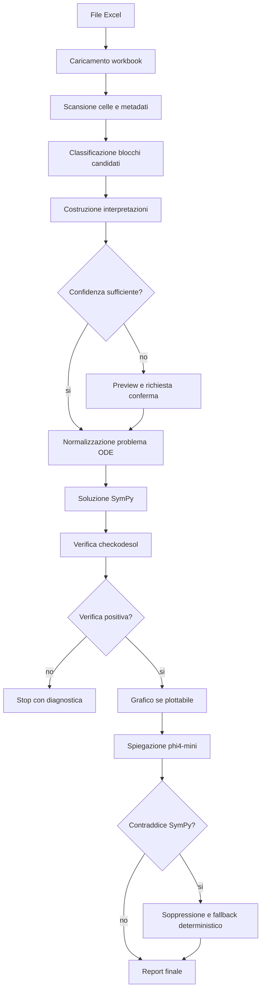
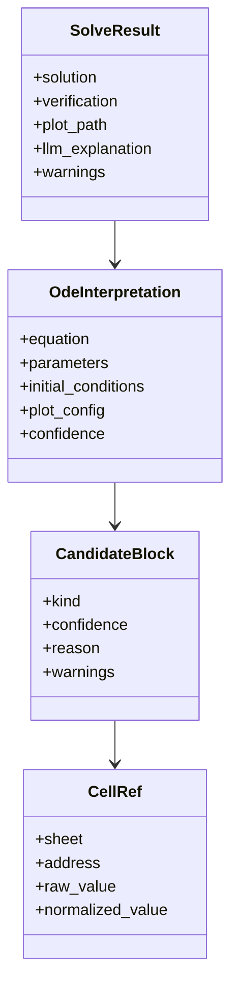
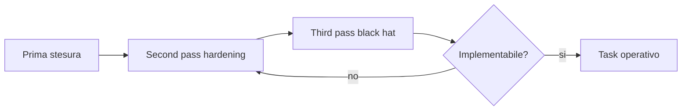

# SPEC-000 - Costituzione del progetto Graph

## Contesto

Graph e' un software Python guidato da SDD per trasformare file Excel elastici in problemi di equazioni differenziali risolvibili, verificabili e spiegabili.

L'utente fornisce un file `.xlsx` o `.xls` in cui equazioni, parametri, condizioni iniziali, intervalli di grafico e note possono trovarsi in un numero non predeterminato di celle. Graph deve costruire una mappa del foglio, proporre interpretazioni candidate, chiedere conferma quando l'ambiguita' e' sostanziale, risolvere con un motore deterministico e produrre risultato simbolico, verifica, grafico e spiegazione.

Il progetto non e' piu' governato dall'obiettivo iniziale di pagina HTML5 per grafici tabellari generici. Le specifiche precedenti restano materiale storico finche' non vengono riallineate, ma la fonte di verita' da questa revisione in poi e' il flusso Excel -> equazioni differenziali -> verifica -> grafico -> spiegazione.

## Decisione costitutiva

- Graph privilegia elasticita' in ingresso e rigidita' in uscita.
- L'Excel puo' essere disordinato; il risultato non puo' esserlo.
- Le interpretazioni automatiche devono avere celle sorgente, confidenza, motivazione e stop condition.
- SymPy e' la fonte primaria per soluzione e verifica matematica.
- Ollama con `phi4-mini` e' ammesso come supporto esplicativo e di riformulazione, non come autorita' matematica.
- `symposium.py` e' ammesso come strumento di coordinamento e contraddittorio SDD quando Redis e' disponibile.

## Fatti noti

- Input: file Excel `.xlsx` o `.xls`.
- Contenuto atteso: equazioni differenziali ordinarie, parametri scalari, condizioni iniziali, intervalli grafici, note descrittive.
- Posizione dei dati: numero e posizione delle celle non predeterminati.
- Ambiente applicativo target: Python locale.
- Motore matematico iniziale: SymPy.
- Motore grafico iniziale: matplotlib con numpy per campionamento numerico.
- LLM locale: `phi4-mini` tramite Ollama.
- Prototipo esistente: `scripts/ode_phi4_solver.py` e `scripts/ode_phi4_mini_solver.py`.
- Regole anti-recidiva gia' osservate: `AI-LEDGER.md` vieta LLM come fonte matematica primaria e sopprime spiegazioni LLM che contraddicono una verifica SymPy positiva.

## Assunzioni

- L'utente accetta una fase di preview e conferma quando il foglio e' ambiguo.
- Il primo rilascio puo' limitarsi a ODE del primo e secondo ordine.
- Un formato Excel libero puo' essere gestito con classificazione per blocchi logici, non con celle fisse.
- Il corpus iniziale puo' essere costruito con file Excel piccoli e casi sintetici.
- L'uso locale di Ollama e' accettabile per privacy e costo.
- `phi4-mini` puo' produrre spiegazioni utili se il prompt e l'output sono vincolati da controlli deterministici.

## Domande aperte

- Quale libreria Python usare per import `.xlsx` e `.xls`: `openpyxl`, `pandas`, `python-calamine`, `xlrd` o combinazione?
- Quale rappresentazione interna usare per mappa celle, blocchi candidati e interpretazioni?
- Quanto deve essere interattiva la conferma utente nel primo prototipo: CLI, file JSON modificabile, piccola UI locale o notebook?
- Quali soglie numeriche iniziali usare per confidenza alta, media e bassa?
- Quali limiti applicare a dimensione file, numero fogli e numero celle candidate?
- Come salvare run, mapping e risultati: JSON locale, cartella output, database leggero o solo console nella prima fase?

## Rischi

- Un Excel molto libero puo' contenere piu' interpretazioni plausibili e incompatibili.
- Celle vicine ma semanticamente non collegate possono essere fuse in un problema matematico errato.
- Parametri mancanti o duplicati possono produrre soluzioni simboliche non plottabili.
- `phi4-mini` puo' contraddire SymPy o inventare una giustificazione.
- La preview puo' diventare troppo verbosa e non aiutare l'utente.
- Il supporto `.xls` puo' richiedere librerie o percorsi separati.
- File grandi o sporchi possono rendere il parsing lento o rumoroso.
- Mermaid e documentazione devono restare leggibili e verificabili nel workspace.

## Segnali di stop

- Nessuna equazione candidata ha confidenza almeno media.
- Piu' equazioni candidate incompatibili superano la soglia media.
- Un parametro richiesto dall'equazione non ha valore confermabile.
- Le condizioni iniziali sono insufficienti per fissare costanti necessarie al grafico.
- `sympy.dsolve` fallisce e non esiste fallback specificato.
- `sympy.checkodesol` non restituisce verifica positiva.
- La spiegazione LLM contraddice una verifica SymPy positiva.
- Una nuova euristica di parsing Excel non e' documentata in specifica.
- Un output non puo' riportare celle sorgente e motivazione.

## Principi di prodotto

- Graph non deve indovinare a ogni costo.
- Graph deve mostrare che cosa ha letto, da quali celle, con quale confidenza.
- Ogni risultato deve essere riproducibile senza l'LLM.
- Ogni spiegazione LLM deve essere subordinata al risultato verificato.
- L'utente deve poter correggere mapping e interpretazione prima del calcolo definitivo.
- Le celle escluse o ambigue sono parte dell'output, non rumore da nascondere.

## Perimetri costitutivi

| Perimetro | Dentro | Fuori nella prima fase | Stop condition |
| --- | --- | --- | --- |
| Input Excel | `.xlsx`, `.xls`, fogli multipli, celle libere | PDF, immagini, database, formule esterne non valutabili | File illeggibile o senza celle testuali/numeriche utili |
| Oggetti riconosciuti | equazione, parametri, condizioni iniziali, range grafico, note | semantica fisica completa, unita' complesse | blocchi richiesti mancanti o conflittuali |
| Equazioni | ODE primo/secondo ordine in notazione `y'`, `y''`, `Derivative` | PDE, sistemi ODE, equazioni stocastiche | piu' forme incompatibili senza conferma |
| Parametri | scalari numerici o simbolici con valore assegnato | vettori, matrici, funzioni parametro | parametro usato ma non valorizzato |
| Condizioni iniziali | `y(0)=...`, `y'(0)=...` | condizioni al contorno avanzate | costanti libere necessarie al grafico |
| Soluzione | `sympy.dsolve`, `checkodesol` | soluzione affidata al solo LLM | verifica SymPy non positiva |
| Grafico | curva `y(x)` reale su intervallo numerico | grafici complessi/multidimensionali | simboli liberi o valori complessi non gestiti |
| LLM | spiegazione, riformulazione, diagnostica | autorita' matematica primaria | contraddizione con SymPy |

## Configurazioni da specificare in ogni implementazione

| Nome | Tipo | Default candidato | Descrizione | Criterio di verifica |
| --- | --- | --- | --- | --- |
| `input_path` | path | obbligatorio | file Excel sorgente | esiste, estensione supportata |
| `sheet_selector` | string/lista | tutti i fogli | fogli da analizzare | fogli presenti nel workbook |
| `scan_max_cells` | intero | da misurare | massimo celle ispezionate | stop controllato se superato |
| `candidate_min_confidence` | enum | `media` | soglia per mostrare candidato | candidato sotto soglia non calcolato |
| `auto_solve_confidence` | enum | `alta` | soglia per calcolo senza conferma | sotto soglia serve conferma |
| `allowed_ode_orders` | lista | `[1, 2]` | ordini ODE supportati | ordine superiore produce stop |
| `independent_variable` | string | `x` | variabile indipendente normalizzata | output normalizzato coerente |
| `dependent_function` | string | `y` | funzione dipendente normalizzata | output normalizzato coerente |
| `plot_x_min` | numero | `0` | minimo asse x | valore numerico |
| `plot_x_max` | numero | `10` | massimo asse x | maggiore di `plot_x_min` |
| `plot_points` | intero | `100` | campioni grafico | almeno 2 |
| `ollama_model` | string | `phi4-mini` | modello esplicativo | risposta non usata per verifica |
| `ollama_host` | URL | `http://localhost:11434` | endpoint Ollama | errore chiaro se non raggiungibile |
| `llm_contradiction_policy` | enum | `suppress` | gestione contraddizioni LLM | contraddizione soppressa con fallback |
| `output_dir` | path | `outputs/` | directory risultati | file generati tracciabili |
| `mapping_output` | JSON | abilitato | mappa celle e confidenza | contiene celle sorgente |

## Pipeline di riferimento

## Modello dati minimo

## Uso dei Sei cappelli nella SDD

Ogni specifica importante su parsing Excel o inferenza matematica deve includere una sezione di revisione con queste lenti:

- Fatti: input, output, vincoli e dati osservabili.
- Rischi e criticita': failure mode, ambiguita', falsi positivi, casi limite.
- Opportunita': valore generato dall'elasticita'.
- Percezione ed emozioni: controllo percepito dall'utente.
- Alternative: strategie di mapping e parsing.
- Decisioni e regia: scelta, owner, prossimo test.

## Black hat obbligatorio

Ogni nuova euristica deve essere accompagnata da una domanda black hat:

> Come puo' questa euristica produrre un risultato matematicamente plausibile ma falso?

La risposta deve diventare almeno uno tra:

- criterio di stop;
- warning;
- test su corpus;
- voce `AI-LEDGER.md`;
- richiesta di conferma utente.

## Second e third pass obbligatori

Ogni specifica che introduce parsing elastico, inferenza matematica o uso LLM deve passare almeno tre stati:

1. Prima stesura: definisce obiettivo, perimetro e criteri principali.
2. Second pass: aggiunge schema dati, invarianti, configurazioni, confidenza, lifecycle e contract di output.
3. Third pass: applica black hat spietato, FMEA, premortem, criteri di rifiuto immediato e test matrix.

Una specifica priva di second e third pass non puo' autorizzare implementazione operativa su Excel reali.

## Definition of Done SDD

Un lavoro funzionale e' chiuso solo se:

- punta a una specifica aggiornata;
- dichiara perimetro, input, output, configurazioni e criteri di accettazione;
- registra celle sorgente o equivalente tracciabile;
- separa fatti, assunzioni e inferenze;
- registra rischi nuovi;
- aggiorna ADR o registri se prende decisioni importanti;
- aggiunge test o verifica manuale proporzionata;
- consulta `AI-LEDGER.md` prima e dopo;
- aggiorna `AI-LEDGER.md` se scopre una recidiva possibile.
- per parsing Excel/ODE, supera i gate `Second pass` e `Third pass` della specifica collegata.

## Criteri di accettazione

- La costituzione dichiara il nuovo scopo Python/Excel/ODE.
- I vecchi obiettivi HTML5/charting sono marcati come storici o da riallineare.
- Tutti i perimetri accettati sono esplicitati.
- Ogni configurazione prevista ha descrizione e criterio di verifica.
- La pipeline include stop condition, verifica SymPy e controllo LLM.
- I diagrammi Mermaid descrivono flusso e modello dati minimo.
