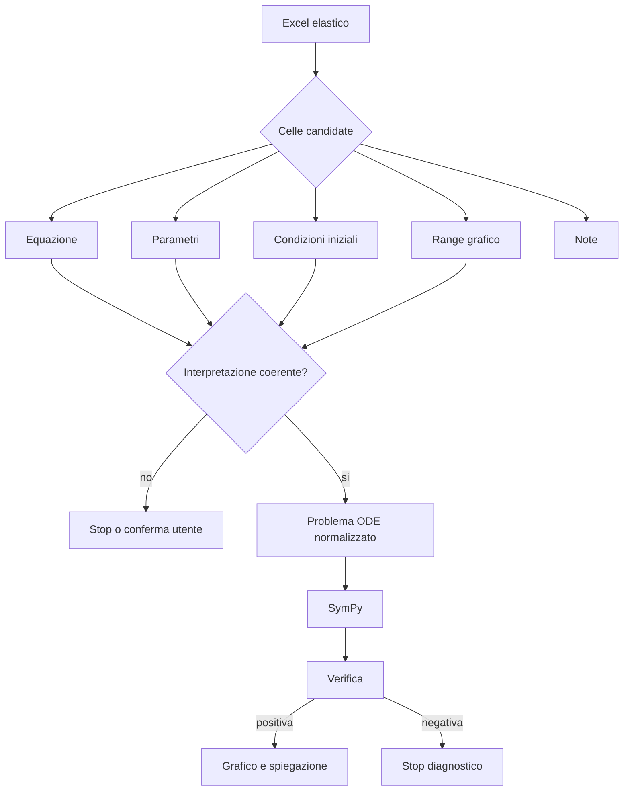
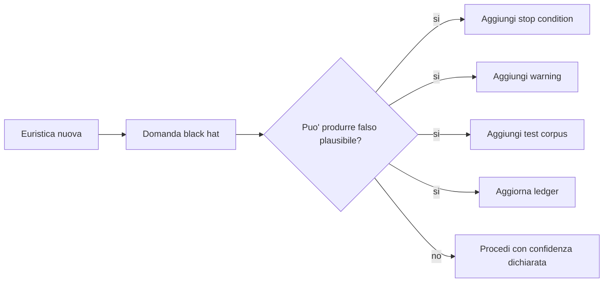
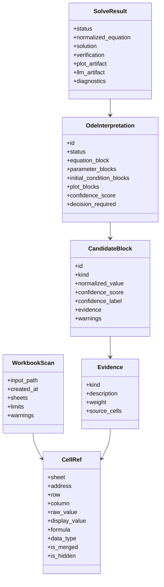
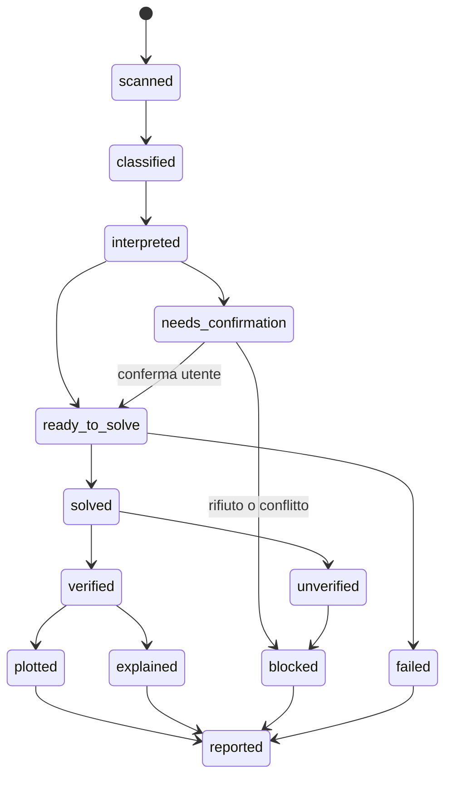

# SPEC-007 - Excel elastici per equazioni differenziali in Python

## Obiettivo

Realizzare Graph come software Python capace di leggere file Excel elastici, individuare celle e blocchi rilevanti per problemi di equazioni differenziali ordinarie, proporre interpretazioni tracciabili, risolvere con SymPy, verificare il risultato, generare grafici quando possibile e produrre una spiegazione con `phi4-mini` tramite Ollama.

La specifica accetta l'obiettivo di elasticita' dell'utente: il file Excel non deve avere celle fisse obbligatorie. Questa elasticita' e' permessa solo se il software rende espliciti perimetro, confidenza, celle sorgente, alternative, ambiguita', stop condition e configurazioni usate.

## Fatti noti

- Il file di input e' Excel `.xlsx` o `.xls`.
- Il numero di celle rilevanti non e' noto a priori.
- Le celle possono contenere testo, formule, numeri, notazione matematica, etichette o note.
- Il risultato desiderato e' analogo agli script `ode_phi4_solver.py` e `ode_phi4_mini_solver.py`.
- Il solver matematico primario e' SymPy.
- Il modello LLM di riferimento e' `phi4-mini` via Ollama.
- Le risposte LLM contraddittorie rispetto a SymPy devono essere soppresse.
- La documentazione deve includere perimetri, configurazioni e diagrammi Mermaid.

## Assunzioni

- Il primo prototipo Excel puo' essere CLI-first.
- La preview puo' essere testuale o JSON nella prima fase.
- La correzione utente puo' avvenire scegliendo tra interpretazioni candidate o modificando un mapping JSON.
- Il workbook contiene almeno una notazione riconoscibile come equazione differenziale o come dato collegato.
- La lingua delle etichette puo' essere italiana o inglese, ma la notazione matematica deve essere riconoscibile.

## Domande aperte

- Quanto deve essere permissivo il parser sulle formule Excel?
- Il primo prototipo deve salvare un report HTML, Markdown, JSON o solo console?
- Le celle con formule Excel devono essere lette come formula, come valore calcolato o entrambe?
- Come rappresentare una conferma utente persistente: file `.mapping.json`, prompt CLI o UI?
- Quale libreria usare per `.xls` legacy se `openpyxl` non basta?

## Rischi e criticita'

- Un numero o una stringa vicino a una equazione puo' essere associato come parametro sbagliato.
- Due blocchi in fogli diversi possono sembrare collegati ma appartenere a problemi distinti.
- Un parametro duplicato puo' avere valori incompatibili.
- Una condizione iniziale puo' riferirsi a un'altra equazione.
- Una cella descrittiva puo' contenere parole come `tempo`, `spazio`, `x`, `t` senza definire variabili.
- Un grafico puo' essere generato da una soluzione matematicamente valida ma non corrispondente al problema inteso.
- `phi4-mini` puo' spiegare male o contraddire la verifica.

## Percezione utente

L'utente deve sentire che Graph sta leggendo il foglio con elasticita', ma non sta inventando. Ogni passaggio automatico deve essere visibile:

- cosa e' stato trovato;
- dove e' stato trovato;
- perche' e' stato interpretato cosi';
- con quale confidenza;
- quali alternative sono state scartate;
- quale intervento umano e' richiesto.

## Perimetro funzionale iniziale

### Dentro

- Workbook `.xlsx`.
- Workbook `.xls` se la libreria scelta lo consente in modo affidabile.
- Uno o piu' fogli.
- Celle sparse contenenti:
  - equazioni in forma `y' = ...`;
  - equazioni in forma `y'' + y = 0`;
  - forme SymPy come `Derivative(y(x), x) = ...`;
  - parametri scalari come `a=2`;
  - condizioni iniziali come `y(0)=1`, `y'(0)=0`;
  - intervalli grafici come `x_min=0`, `x_max=10`, `points=100`;
  - note descrittive.
- ODE del primo e secondo ordine.
- Una o piu' interpretazioni candidate.
- Preview obbligatoria quando la confidenza non e' alta.
- Output con mappa celle, soluzione, verifica, grafico e spiegazione.

### Fuori nella prima fase

- PDE.
- Sistemi di ODE accoppiate.
- Equazioni stocastiche.
- Condizioni al contorno avanzate.
- Unita' fisiche e conversioni dimensionali complete.
- Grafici 3D o multidimensionali.
- OCR da immagini o PDF.
- Soluzione basata solo su LLM.

## Perimetri accettati

| ID | Perimetro | Regola | Output obbligatorio |
| --- | --- | --- | --- |
| P-001 | Elasticita' celle | Nessuna cella fissa obbligatoria | mappa celle candidate |
| P-002 | Confidenza | Ogni candidato ha `alta`, `media` o `bassa` | motivazione e warning |
| P-003 | Ambiguita' | Interpretazioni incompatibili fermano il calcolo automatico | elenco alternative |
| P-004 | ODE supportate | Ordine 1 e 2 nella prima fase | ordine rilevato |
| P-005 | Parametri | Solo scalari con valore assegnato | tabella parametri usati |
| P-006 | Condizioni iniziali | Forme `y(x0)=v`, `y'(x0)=v` | condizioni normalizzate |
| P-007 | Solver | SymPy e `checkodesol` | verifica riportata |
| P-008 | Grafico | Solo `y(x)` reale plottabile | range, punti, file output |
| P-009 | LLM | Solo spiegazione e mapping assistito | prompt, risposta o fallback |
| P-010 | Tracciabilita' | Nessun risultato senza celle sorgente | cell refs nel report |

## Configurazioni software

### Import Excel

| Parametro | Tipo | Default candidato | Obbligatorio | Descrizione | Stop condition |
| --- | --- | --- | --- | --- | --- |
| `input_path` | path | nessuno | si | file Excel da analizzare | file assente o estensione non supportata |
| `sheet_selector` | string/lista | `*` | no | fogli da scansionare | foglio richiesto assente |
| `read_formulas` | boolean | `true` | no | conserva formula Excel quando disponibile | formula illeggibile solo come warning |
| `read_cached_values` | boolean | `true` | no | legge valore calcolato se disponibile | nessun valore e nessuna formula utile |
| `scan_max_sheets` | intero | `20` | no | massimo fogli analizzati | superamento produce stop controllato |
| `scan_max_cells` | intero | `20000` | no | massimo celle ispezionate | superamento produce stop controllato |
| `include_hidden_sheets` | boolean | `false` | no | include fogli nascosti | foglio nascosto escluso e segnalato |

### Rilevamento candidati

| Parametro | Tipo | Default candidato | Descrizione | Verifica |
| --- | --- | --- | --- | --- |
| `candidate_min_confidence` | enum | `media` | soglia minima per proporre candidato | candidati bassi solo come indizi |
| `auto_solve_confidence` | enum | `alta` | soglia per calcolo senza conferma | sotto soglia serve HITL |
| `cell_neighborhood_radius` | intero | `3` | celle vicine usate per associare etichette e valori | associazioni motivate |
| `max_candidate_interpretations` | intero | `5` | massimo interpretazioni mostrate | oltre soglia serve filtro utente |
| `language_hints` | lista | `it,en` | etichette riconosciute | etichette non note diventano note |

### Normalizzazione matematica

| Parametro | Tipo | Default candidato | Descrizione | Stop condition |
| --- | --- | --- | --- | --- |
| `independent_variable` | string | `x` | variabile indipendente normalizzata | conflitto non risolto tra `x` e `t` |
| `dependent_function` | string | `y` | funzione dipendente normalizzata | piu' funzioni senza supporto sistemi |
| `allowed_ode_orders` | lista | `[1, 2]` | ordini ammessi | ordine non supportato |
| `implicit_equation_support` | boolean | `true` | consente `y' + k*y = sin(x)` | parsing SymPy fallito |
| `parameter_policy` | enum | `require_value` | parametri usati devono avere valore | parametro senza valore |

### Soluzione e verifica

| Parametro | Tipo | Default candidato | Descrizione | Stop condition |
| --- | --- | --- | --- | --- |
| `solver` | string | `sympy.dsolve` | motore simbolico | solver fallisce |
| `verification` | string | `sympy.checkodesol` | verifica soluzione | verifica non positiva |
| `allow_unverified_solution` | boolean | `false` | stampa soluzione non verificata | non deve passare acceptance |
| `constant_policy` | enum | `require_ics_for_plot` | costanti libere ammesse solo senza grafico | grafico richiesto con costanti libere |

### Grafico

| Parametro | Tipo | Default candidato | Descrizione | Stop condition |
| --- | --- | --- | --- | --- |
| `plot_enabled` | boolean | `true` | abilita grafico se possibile | soluzione non plottabile |
| `plot_x_min` | numero | `0` | minimo x | non numerico |
| `plot_x_max` | numero | `10` | massimo x | <= `plot_x_min` |
| `plot_points` | intero | `100` | campioni | < 2 |
| `plot_output_format` | enum | `png` | formato output | formato non supportato |
| `plot_complex_policy` | enum | `reject` | valori complessi | valori complessi non reali |

### Ollama e phi4-mini

| Parametro | Tipo | Default candidato | Descrizione | Regola |
| --- | --- | --- | --- | --- |
| `ollama_host` | URL | `http://localhost:11434` | endpoint locale | errore leggibile se non raggiungibile |
| `ollama_model` | string | `phi4-mini` | modello LLM | non configurabile nella variante standalone |
| `ollama_timeout` | intero | `180` | timeout secondi | timeout non invalida SymPy |
| `llm_role` | enum | `explain_only` | ruolo modello | vietato risolvere come fonte primaria |
| `llm_contradiction_policy` | enum | `suppress` | risposta contraddittoria | fallback deterministico |

### Output

| Parametro | Tipo | Default candidato | Descrizione | Verifica |
| --- | --- | --- | --- | --- |
| `output_dir` | path | `outputs/` | cartella risultati | creata o errore chiaro |
| `save_mapping_json` | boolean | `true` | salva mappa celle | JSON contiene cell refs |
| `save_report_markdown` | boolean | `true` | salva report leggibile | contiene soluzione e verifica |
| `save_plot` | boolean | `true` | salva grafico | path riportato |
| `include_llm_prompt` | boolean | `true` | salva prompt per audit | prompt tracciabile |

## Diagramma dei perimetri



## Diagramma black hat



## Criteri di accettazione

- AC-001: dato un workbook con una equazione e parametri chiaramente etichettati, Graph produce una interpretazione ad alta confidenza.
- AC-002: dato un workbook con due equazioni incompatibili, Graph non calcola automaticamente e mostra alternative.
- AC-003: ogni parametro usato nella soluzione riporta cella sorgente, valore normalizzato e confidenza.
- AC-004: se un parametro richiesto manca, Graph produce stop diagnostico.
- AC-005: se SymPy restituisce soluzione verificata `(True, 0)`, Graph riporta la soluzione come verificata.
- AC-006: se `phi4-mini` contraddice una verifica positiva, Graph sopprime la risposta LLM e mostra fallback deterministico.
- AC-007: se la soluzione contiene simboli liberi e il grafico e' richiesto, Graph non genera grafico e spiega il simbolo mancante.
- AC-008: ogni report include mappa celle, interpretazione scelta, alternative escluse, warning, soluzione, verifica e configurazioni usate.
- AC-009: ogni configurazione non default compare nel report.
- AC-010: i diagrammi Mermaid della specifica renderizzano senza errori sintattici di base.

## Strategia di test iniziale

| Caso | Descrizione | Esito atteso |
| --- | --- | --- |
| CASE-ODE-001 | `y' = a*y`, `a=2`, `y(0)=1` in celle vicine | soluzione `exp(2*x)` verificata |
| CASE-ODE-002 | stessa equazione, parametro `a` mancante | stop parametro mancante |
| CASE-ODE-003 | due valori `a=2` e `a=3` con pari confidenza | richiesta conferma |
| CASE-ODE-004 | `y'' + y = 0`, `y(0)=0`, `y'(0)=1` | soluzione verificata e grafico |
| CASE-ODE-005 | equazione e note lontane non correlate | note non usate come parametri |
| CASE-ODE-006 | risposta LLM contraddittoria simulata | soppressione e fallback |

## Uso di symposium

Quando Redis e' disponibile, ogni cambio rilevante di specifica deve aprire o aggiornare un thread `symposium` con:

- cappello bianco: fatti verificati;
- cappello nero: failure mode e stop condition;
- cappello verde: alternative di parsing;
- cappello blu: decisione finale e prossimo task.

Per questa rifondazione il thread iniziale e' `#13`.

## Second pass - hardening della specifica

Questa sezione corregge una debolezza della prima stesura: dichiarava i perimetri, ma non definiva ancora in modo abbastanza operativo cosa conta come evidenza, come si calcola la confidenza, come si costruisce una interpretazione e quando un risultato deve essere bloccato.

### Glossario operativo vincolante

| Termine | Definizione | Non e' |
| --- | --- | --- |
| Cella osservata | cella Excel letta con indirizzo, foglio, valore grezzo, tipo e contesto locale | una inferenza semantica |
| Evidenza | dato osservabile che supporta una classificazione o un collegamento | una conclusione |
| Blocco candidato | gruppo di celle con ruolo ipotizzato: equazione, parametro, condizione iniziale, range, nota | problema matematico completo |
| Interpretazione | combinazione coerente di blocchi candidati che produce un problema ODE normalizzabile | verita' matematica o business |
| Confidenza | punteggio motivato sulla solidita' di una classificazione o associazione | probabilita' statistica calibrata |
| Conferma utente | decisione esplicita che sceglie o corregge una interpretazione | decorazione UI |
| Stop diagnostico | uscita controllata con motivo, celle coinvolte e prossimo passo | crash o silenzio |
| Soluzione verificata | risultato SymPy con verifica positiva | spiegazione LLM |
| Report tracciabile | output che consente di ricostruire input, mapping, decisioni e risultato | solo grafico o solo formula |

### Invarianti di sistema

Questi invarianti non sono preferenze. Sono condizioni per considerare valido un run.

| ID | Invariante | Verifica |
| --- | --- | --- |
| INV-001 | Ogni dato usato nel problema deriva da almeno una `CellRef` o da default dichiarato | report contiene `source_cells` o `default_reason` |
| INV-002 | Ogni blocco candidato ha `kind`, `confidence`, `evidence`, `source_cells`, `warnings` | validazione schema |
| INV-003 | Ogni interpretazione ha una sola equazione primaria | validazione interpretazione |
| INV-004 | Ogni simbolo libero usato dall'equazione e non appartenente a variabili/funzioni deve essere risolto come parametro o costante ammessa | analisi `free_symbols` |
| INV-005 | Nessuna interpretazione con confidenza sotto `auto_solve_confidence` puo' essere risolta senza conferma | controllo gate |
| INV-006 | `phi4-mini` non puo' modificare equazione, parametri, condizioni iniziali o soluzione dopo la verifica | confronto prima/dopo |
| INV-007 | Una verifica SymPy non positiva blocca grafico e spiegazione assertiva | stato `blocked` |
| INV-008 | Ogni warning critico deve comparire nel report finale | report contiene `critical_warnings` |
| INV-009 | Le alternative scartate non vengono cancellate | report contiene `rejected_interpretations` |
| INV-010 | Ogni euristica nuova deve avere test o voce ledger | review SDD |

### Schema dati normativo

Ogni implementazione deve convergere verso questo schema logico. I nomi possono cambiare solo con ADR o aggiornamento della specifica.



### JSON minimo del report

Il report JSON deve essere validabile almeno a questo livello:

```json
{
  "run_id": "string",
  "input": {
    "path": "string",
    "sheets_scanned": ["string"],
    "limits": {}
  },
  "configuration": {},
  "candidate_blocks": [
    {
      "id": "B001",
      "kind": "equation|parameter|initial_condition|plot_range|note|unknown",
      "normalized_value": "string",
      "confidence_score": 0.0,
      "confidence_label": "alta|media|bassa",
      "source_cells": [{"sheet": "Foglio1", "address": "A1"}],
      "evidence": [],
      "warnings": []
    }
  ],
  "interpretations": [
    {
      "id": "I001",
      "status": "candidate|selected|rejected|blocked",
      "confidence_score": 0.0,
      "blocks": ["B001"],
      "decision_required": true,
      "rejection_reason": ""
    }
  ],
  "selected_interpretation": "I001",
  "solve_result": {
    "status": "solved|blocked|failed",
    "solution": "string",
    "verification": "string",
    "plot": null,
    "llm_explanation": null
  },
  "diagnostics": {
    "warnings": [],
    "stop_reason": null
  }
}
```

### Classificazione celle

La classificazione deve usare evidenze additive e penalita'. Nessuna singola euristica puo' bastare se produce conflitto con evidenze forti contrarie.

| Feature | Supporta | Peso iniziale | Black hat |
| --- | --- | --- | --- |
| contiene `y'`, `y''`, `Derivative` | equazione | +40 | apostrofo in testo non matematico |
| contiene `=` e simboli matematici | equazione/parametro/condizione | +15 | uguaglianza descrittiva |
| pattern `nome=numero` | parametro | +35 | valore di legenda o ID |
| pattern `y(0)=...` | condizione iniziale | +45 | esempio nel testo |
| etichetta vicina `parametro`, `parameter` | parametro | +20 | tabella descrittiva non usata |
| etichetta vicina `equazione`, `equation`, `ODE` | equazione | +25 | titolo di sezione generica |
| vicinanza entro `cell_neighborhood_radius` | associazione | +10 | celle vicine ma non collegate |
| stesso blocco visuale o tabellare | associazione | +15 | layout estetico |
| foglio o sezione con nome coerente | associazione | +10 | nome foglio troppo generico |
| conflitto simbolico | penalita' | -40 | conflitto reale da fermare |
| duplicato incompatibile | penalita' | -60 | piu' scenari nello stesso workbook |

### Formula di confidenza iniziale

La confidenza numerica iniziale e':

```text
score = clamp(0, 100, somma_evidenze_positive - somma_penalita)
```

Le etichette sono:

| Etichetta | Score | Comportamento |
| --- | --- | --- |
| alta | `>= 80` | puo' entrare in interpretazione risolvibile |
| media | `50..79` | puo' essere proposta, ma richiede conferma se incide sul calcolo |
| bassa | `< 50` | resta indizio, non puo' essere usata automaticamente |

Regola severa: la confidenza dell'interpretazione non puo' superare la confidenza minima dei blocchi essenziali che la compongono.

```text
interpretation_score <= min(equation_score, required_parameter_scores, required_initial_condition_scores)
```

### Blocchi essenziali e opzionali

| Blocco | Essenziale | Regola |
| --- | --- | --- |
| Equazione | si | esattamente una primaria per interpretazione |
| Parametri presenti nell'equazione | si se valorizzati nel testo | ogni simbolo libero non variabile deve essere risolto |
| Condizioni iniziali | si per grafico senza costanti libere | se mancano, soluzione simbolica ammessa ma grafico bloccato |
| Range grafico | no | default ammesso se dichiarato |
| Note | no | non possono cambiare il calcolo senza conferma |

### Stati del ciclo di vita



### Matrice conflitti

| Conflitto | Esempio | Severita' | Azione |
| --- | --- | --- | --- |
| piu' equazioni primarie | `y'=a*y` e `y''+y=0` | alta | creare interpretazioni separate e chiedere scelta |
| parametro duplicato incompatibile | `a=2`, `a=3` | alta | bloccare autocalcolo |
| variabile indipendente ambigua | `x` e `t` usati come indipendenti | media-alta | chiedere conferma |
| condizione iniziale incompatibile | `y(0)=1`, `y(0)=2` | alta | bloccare |
| range grafico invertito | `x_min=10`, `x_max=0` | media | usare stop diagnostico |
| note simili a dati | "esempio: a=2" | media | non usare senza evidenza aggiuntiva |
| fogli multipli con scenari | foglio `Caso1`, `Caso2` | media | separare run candidati |

### Regole HITL

L'intervento umano e' obbligatorio quando:

- una interpretazione essenziale ha confidenza media;
- due interpretazioni differiscono per equazione, parametro o condizione iniziale;
- il parser trova piu' valori per lo stesso parametro;
- una nota testuale e' necessaria per capire il significato di una cella;
- un default inciderebbe sul grafico o sul risultato;
- `phi4-mini` suggerisce una riformulazione non derivabile dalle celle.

L'intervento umano deve produrre un artefatto:

```text
confirmation:
  selected_interpretation: I001
  changed_blocks: [...]
  rejected_blocks: [...]
  reason: "..."
  confirmed_by: "utente"
  timestamp: "..."
```

### Esempi di layout Excel supportati

#### Layout verticale

| Cella | Valore |
| --- | --- |
| A1 | Equazione |
| B1 | `y' = a*y` |
| A2 | Parametro |
| B2 | `a=2` |
| A3 | Condizione iniziale |
| B3 | `y(0)=1` |

Esito: interpretazione alta se nessun conflitto.

#### Layout sparso

| Cella | Valore |
| --- | --- |
| C5 | `y' = a*y` |
| H2 | `a=2` |
| D9 | `y(0)=1` |

Esito: possibile interpretazione media o alta solo se evidenze di contesto collegano le celle. Altrimenti preview obbligatoria.

#### Layout multi-scenario

| Cella | Valore |
| --- | --- |
| A1 | Caso A |
| B1 | `y'=2*y` |
| A5 | Caso B |
| B5 | `y'=3*y` |

Esito: due interpretazioni separate, nessun autocalcolo unico.

## Third pass - black hat spietato e FMEA

Questa sezione assume che il sistema fallira' se gli viene permesso di essere ottimista. Ogni failure mode qui sotto deve diventare test, warning o stop condition prima dell'implementazione completa.

### Premortem

Immaginiamo che tra tre mesi Graph abbia prodotto risultati sbagliati ma plausibili. Le cause probabili sono:

- ha unito celle vicine ma non correlate;
- ha scelto il parametro sbagliato tra duplicati;
- ha trattato un esempio testuale come dato reale;
- ha ignorato il foglio o la sezione di scenario;
- ha generato un grafico con default non dichiarati;
- ha lasciato a `phi4-mini` una frase assertiva non verificata;
- ha nascosto alternative scartate;
- ha confuso soluzione matematica del problema normalizzato con correttezza semantica del mapping Excel.

### FMEA

| Failure mode | Effetto | Causa | Severita' | Probabilita' | Rilevabilita' | Mitigazione | Test obbligatorio |
| --- | --- | --- | --- | --- | --- | --- | --- |
| parametro sbagliato associato | soluzione verificata per problema falso | vicinanza celle | 10 | 7 | 5 | confidenza, preview, source cells | `CASE-ODE-003` |
| equazione sbagliata scelta | output completamente errato | piu' scenari | 10 | 6 | 6 | interpretazioni separate | multi-scenario |
| condizione iniziale di altro problema | costante errata | layout sparso | 9 | 6 | 5 | collegamento per blocco | condizione lontana |
| LLM contraddice SymPy | sfiducia o decisione errata | allucinazione | 8 | 6 | 9 | soppressione | risposta simulata |
| formula Excel non aggiornata | parametro vecchio | cached value stale | 8 | 4 | 4 | leggere formula e valore | formula/value mismatch |
| celle nascoste contengono dati | dato ignorato | hidden sheet/row | 6 | 4 | 7 | warning fogli nascosti | hidden sheet |
| grafico con simboli liberi | curva arbitraria | condizioni mancanti | 8 | 5 | 8 | blocco grafico | no ICS |
| default range non dichiarato | interpretazione visiva fuorviante | omissione report | 5 | 6 | 8 | report config | default plot |
| `.xls` letto male | celle perse | libreria inadatta | 7 | 5 | 6 | ADR libreria | file legacy |
| unità fisiche ignorate | scala errata | fuori perimetro | 7 | 5 | 3 | warning unita' | units note |

Legenda: severita', probabilita' e rilevabilita' sono su scala 1-10. Valori alti di severita' richiedono stop o test, non solo warning.

### Regole black hat non negoziabili

1. Una soluzione SymPy verificata dimostra solo che il problema normalizzato e' coerente, non che il mapping Excel e' semanticamente giusto.
2. La mappa celle e' parte del risultato matematico. Senza mappa, il risultato e' incompleto.
3. Un parametro con due valori non e' un dettaglio: e' un conflitto.
4. Una nota testuale non e' dato operativo finche' non viene classificata e confermata.
5. Un default e' una decisione. Ogni default deve comparire nel report.
6. Un grafico puo' rendere credibile un errore. Il grafico richiede piu' prudenza della formula.
7. Il LLM non deve mai essere l'unico componente che capisce perche' una cella e' stata usata.
8. Le celle escluse sono informative: possono provare che il parser ha ignorato un'alternativa.
9. L'assenza di errore non e' successo; successo significa soddisfare acceptance criteria.
10. Se un essere umano non puo' ricostruire il risultato dal report, il run fallisce.

### Gate di implementazione

Un PR o task che implementa parsing Excel non puo' essere accettato se manca almeno uno di questi output:

- `workbook_scan.json`;
- `candidate_blocks.json`;
- `interpretations.json`;
- `selected_interpretation.json`;
- `solve_result.json`;
- `report.md`;
- eventuale `plot.png`;
- `warnings` e `stop_reason` se presenti.

### Checklist di review spietata

| Domanda | Risposta accettabile |
| --- | --- |
| Quali celle hanno determinato l'equazione? | elenco `sheet!address` |
| Quali celle hanno determinato ogni parametro? | elenco `sheet!address` per parametro |
| Quali celle sono state ignorate ma sembravano candidate? | elenco con motivo |
| Perche' questa interpretazione ha vinto? | score, evidenze, conflitti assenti |
| Cosa avrebbe potuto essere interpretato diversamente? | alternative nel report |
| Quale default e' stato usato? | nome, valore, motivo |
| SymPy ha verificato? | output `checkodesol` |
| Il grafico usa simboli liberi? | no, oppure grafico bloccato |
| Il LLM ha contraddetto la verifica? | no, oppure soppresso |
| Esiste un test che copre il rischio principale? | nome caso |

### Criteri di rifiuto immediato

Rifiutare l'implementazione o il run se:

- produce solo formula e grafico senza mapping;
- usa `phi4-mini` per decidere parametri mancanti;
- risolve nonostante conflitto parametro;
- nasconde una interpretazione alternativa plausibile;
- chiama `checkodesol` ma ignora un esito negativo;
- genera grafico dopo verifica negativa;
- usa default non riportati;
- non salva le configurazioni effettive;
- non distingue errore di parsing, stop diagnostico e fallimento solver.

### Test matrix estesa

| ID | Layout | Input | Rischio coperto | Esito richiesto |
| --- | --- | --- | --- | --- |
| CASE-ODE-001 | verticale pulito | equazione, `a=2`, `y(0)=1` | baseline | solve verified |
| CASE-ODE-002 | parametro mancante | equazione con `a` | free symbol | stop parametro |
| CASE-ODE-003 | duplicato | `a=2`, `a=3` | conflitto | HITL |
| CASE-ODE-004 | secondo ordine | `y''+y=0`, due IC | ordine 2 | solve verified |
| CASE-ODE-005 | note ingannevoli | "esempio: a=2" | falso parametro | warning/no use |
| CASE-ODE-006 | LLM contraddittorio | risposta simulata | allucinazione | suppress |
| CASE-ODE-007 | multi-foglio | Caso A/B | scenario split | interpretazioni separate |
| CASE-ODE-008 | hidden sheet | dati nascosti | omissione | warning |
| CASE-ODE-009 | formula/value mismatch | formula e cached value divergenti | stale data | warning |
| CASE-ODE-010 | range invertito | `x_min=10`, `x_max=0` | grafico falso | stop grafico |
| CASE-ODE-011 | variabile ambigua | `x`, `t` | normalizzazione | HITL |
| CASE-ODE-012 | testo con apostrofo | frase con `'` | falso y prime | no equation |

### Definizione di precisione sufficiente

La SDD e' sufficientemente precisa solo quando una persona diversa dall'autore puo' implementare un primo parser e sapere:

- quali celle leggere;
- quali oggetti produrre;
- come assegnare confidenza iniziale;
- quando fermarsi;
- quali file salvare;
- quali test minimi eseguire;
- come impedire a `phi4-mini` di diventare fonte di verita'.

Se una di queste risposte manca, la specifica resta in stato non implementabile.
